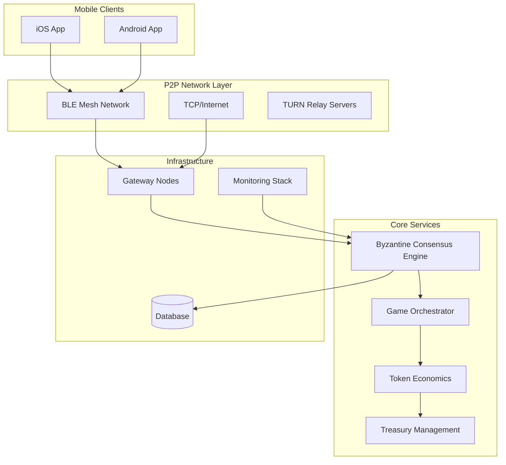
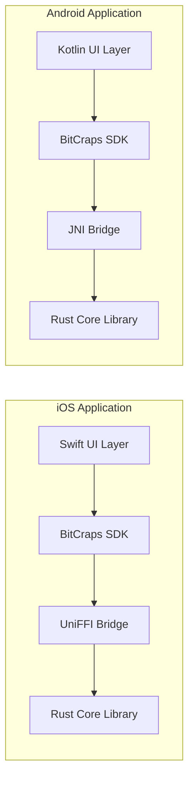
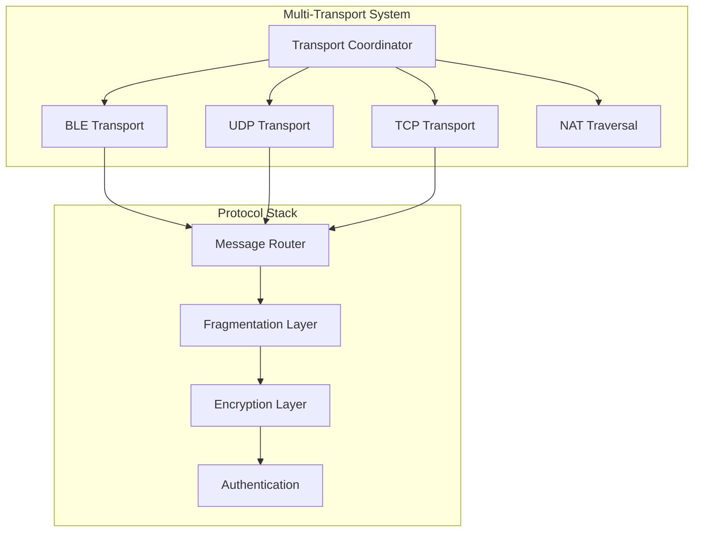
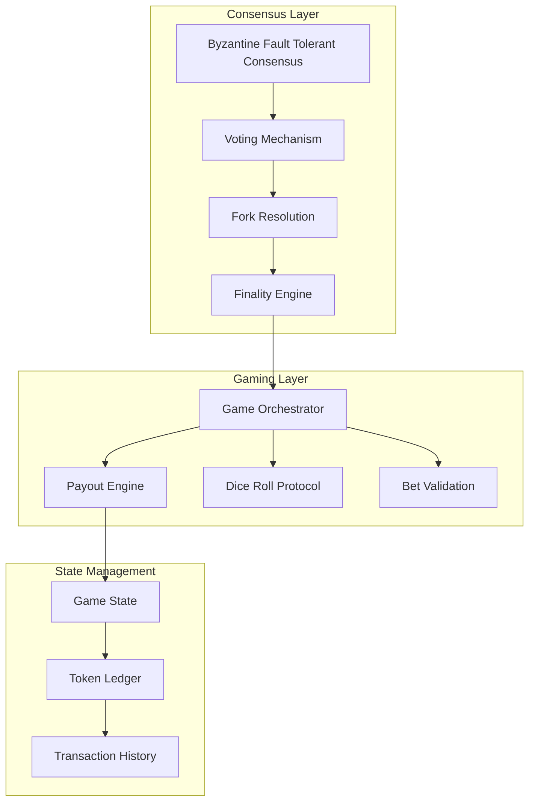
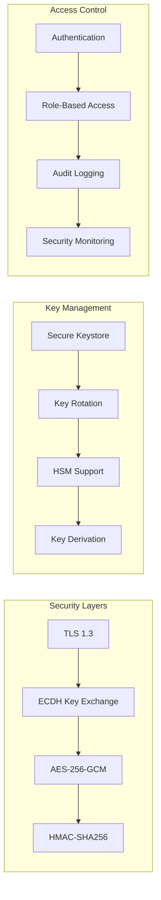
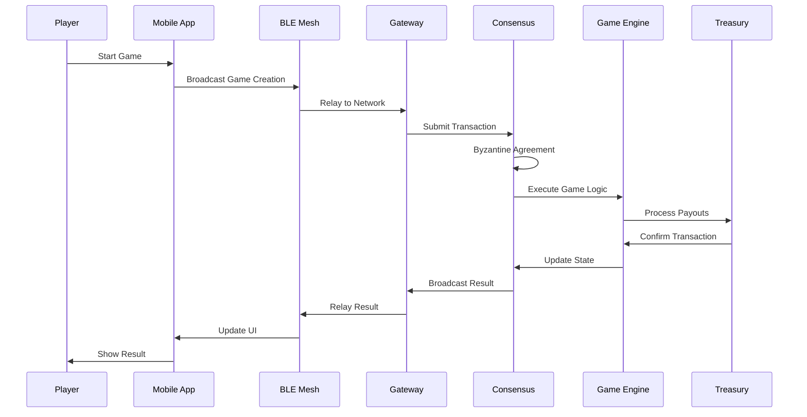
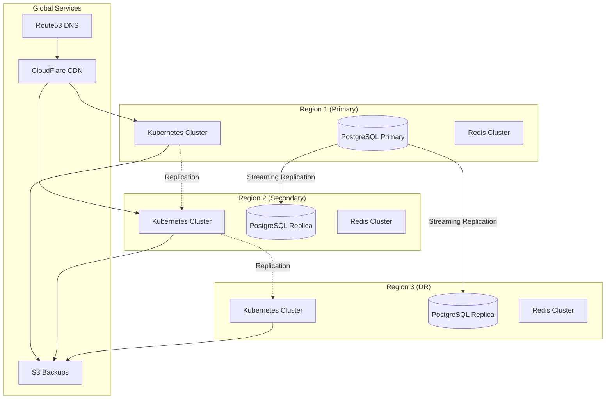
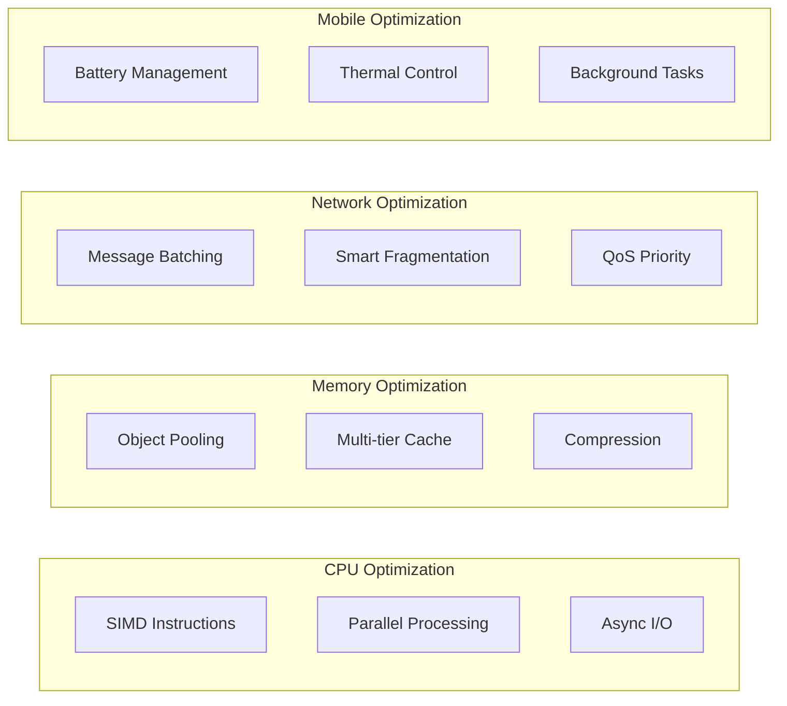
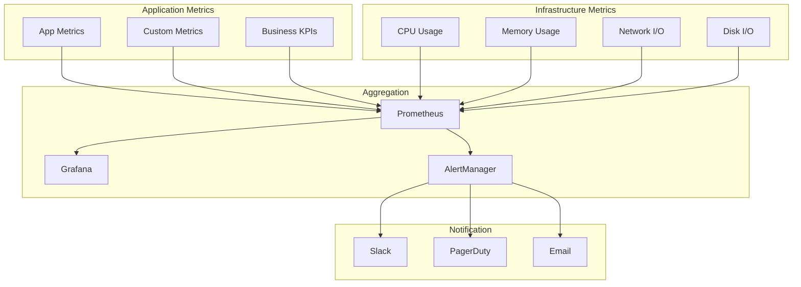

# BitCraps System Architecture

## High-Level Architecture Overview



## Detailed Component Architecture

### 1. Mobile Layer Architecture



### 2. Network Transport Architecture



### 3. Consensus & Gaming Architecture



### 4. Security Architecture



## Data Flow Architecture

### Game Flow Sequence



## Deployment Architecture

### Kubernetes Deployment

```yaml
Deployment Structure:
├── Namespaces
│   ├── bitcraps-production
│   ├── bitcraps-staging
│   └── bitcraps-monitoring
├── Core Services
│   ├── gateway-nodes (3-10 replicas)
│   ├── consensus-nodes (5-15 replicas)
│   └── turn-servers (2-4 replicas)
├── Data Layer
│   ├── postgresql-primary
│   ├── postgresql-replicas (2-3)
│   └── redis-cluster (3 nodes)
├── Monitoring
│   ├── prometheus
│   ├── grafana
│   └── alertmanager
└── Ingress
    ├── nginx-ingress
    └── cert-manager
```

### Multi-Region Architecture



## Technology Stack

### Core Technologies

| Layer | Technology | Purpose |
|-------|------------|---------|
| **Language** | Rust | Core implementation |
| **Mobile** | Swift/Kotlin | Native mobile apps |
| **Networking** | Tokio | Async runtime |
| **Database** | PostgreSQL/SQLite | Data persistence |
| **Cache** | Redis | Session/game state |
| **Consensus** | Custom BFT | Byzantine fault tolerance |
| **Cryptography** | Ring/Snow | Encryption & signatures |
| **Monitoring** | Prometheus/Grafana | Metrics & visualization |
| **Container** | Docker | Containerization |
| **Orchestration** | Kubernetes | Container orchestration |
| **CI/CD** | GitHub Actions | Automation |

### Protocol Stack

```
Application Layer
├── Game Protocol (Craps rules, betting)
├── Token Economics (Staking, rewards)
└── Chat/Social Features

Consensus Layer
├── Byzantine Fault Tolerant Consensus
├── Fork Resolution
└── Finality Guarantees

Network Layer
├── P2P Mesh Networking
├── Multi-Transport (BLE/TCP/UDP)
├── NAT Traversal
└── Gateway Bridging

Security Layer
├── End-to-End Encryption
├── Digital Signatures
├── Key Management
└── Access Control

Physical Layer
├── Bluetooth Low Energy
├── Internet (TCP/IP)
└── TURN Relay Servers
```

## Performance Architecture

### Optimization Strategies



### Scalability Metrics

| Component | Capacity | Latency | Throughput |
|-----------|----------|---------|------------|
| **BLE Mesh** | 50 peers/node | <500ms | 100 msg/s |
| **Gateway** | 1000 connections | <100ms | 10K msg/s |
| **Consensus** | 100 nodes | <2s finality | 1000 tx/s |
| **Database** | 10M records | <10ms read | 5000 ops/s |
| **Game Engine** | 1000 games | <50ms | 100 games/s |

## Security Architecture

### Defense in Depth

```
Layer 1: Network Security
├── DDoS Protection (CloudFlare)
├── WAF (Web Application Firewall)
├── Rate Limiting
└── IP Whitelisting

Layer 2: Application Security
├── Input Validation
├── SQL Injection Prevention
├── XSS Protection
└── CSRF Tokens

Layer 3: Data Security
├── Encryption at Rest (AES-256)
├── Encryption in Transit (TLS 1.3)
├── Key Management (HSM ready)
└── Data Masking

Layer 4: Access Control
├── Multi-factor Authentication
├── Role-Based Access Control
├── API Key Management
└── Session Management

Layer 5: Monitoring & Response
├── Security Event Logging
├── Anomaly Detection
├── Incident Response
└── Forensics Capability
```

## Monitoring & Observability

### Metrics Collection



## Disaster Recovery Architecture

### Backup Strategy

```
Backup Types:
├── Database Backups
│   ├── Full backup (daily)
│   ├── Incremental (hourly)
│   └── Transaction logs (continuous)
├── Configuration Backups
│   ├── Kubernetes manifests
│   ├── Helm values
│   └── Secrets (encrypted)
└── State Backups
    ├── Game state snapshots
    ├── Token ledger
    └── User data

Recovery Targets:
├── RTO (Recovery Time Objective): 1 hour
├── RPO (Recovery Point Objective): 15 minutes
└── Backup Retention: 30 days
```

## Future Architecture Considerations

### Planned Enhancements

1. **Multi-Chain Support**
   - Ethereum integration
   - Polygon/Arbitrum L2
   - Cross-chain bridges

2. **Advanced Features**
   - AI-powered anti-cheat
   - Machine learning for fraud detection
   - Predictive scaling

3. **Geographic Expansion**
   - Regional gateway nodes
   - Localized content delivery
   - Compliance automation

4. **Performance Improvements**
   - WebAssembly runtime
   - GPU acceleration
   - Edge computing nodes

---

*This architecture document represents the current state of the BitCraps system and will evolve as the platform grows and requirements change.*