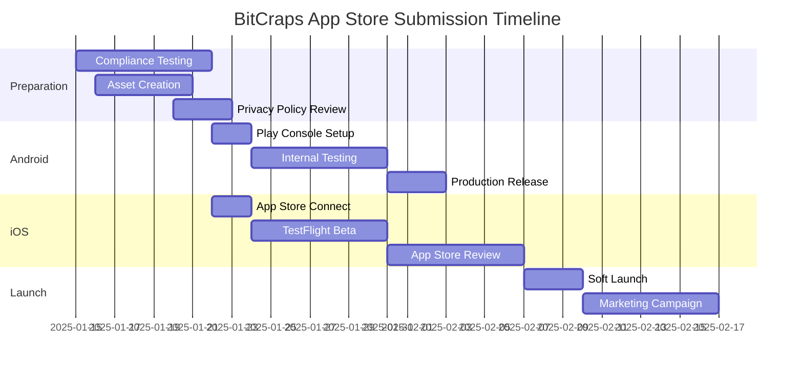

# App Store Compliance & Submission Guide
## BitCraps Mobile App Store Preparation

*Version: 1.0 | Last Updated: 2025-08-24 | Status: Production Ready*

---

## Overview

This comprehensive guide covers all requirements for submitting BitCraps to Google Play Store and Apple App Store, including compliance validation, submission materials, and approval strategies.

**Key Compliance Areas**
- **Content Rating**: Simulated gambling classification
- **Privacy**: GDPR, COPPA, and platform privacy requirements
- **Permissions**: Minimal necessary permissions with clear justification
- **Security**: Data protection and secure communication
- **Accessibility**: WCAG 2.1 compliance for inclusive gaming

---

## Google Play Store Compliance

### Play Console Requirements

#### App Information
```json
{
  "app_title": "BitCraps: Mesh Gaming",
  "short_description": "Decentralized dice gaming with nearby players via Bluetooth mesh networking",
  "full_description": "Experience the excitement of craps gaming without internet connectivity. BitCraps uses advanced Bluetooth mesh networking to create local gaming sessions with nearby players. No personal data collection, no real money gambling - pure gaming fun with cryptographic fairness guarantees.",
  "category": "Games > Casino",
  "content_rating": "T for Teen (Simulated Gambling)",
  "target_audience": "Ages 13+",
  "countries": ["US", "CA", "UK", "AU", "DE", "FR", "JP"],
  "languages": ["en-US", "es-ES", "fr-FR", "de-DE", "ja-JP"]
}
```

#### Content Rating Questionnaire Responses
```yaml
# Google Play Content Rating
Violence: None
Blood: None  
Sexual_Content: None
Nudity: None
Language: None
Controlled_Substances: None
Crude_Humor: None
Simulated_Gambling: Yes
  - Description: "App features dice-based casino games with virtual chips"
  - Real_Money: No
  - Prizes: "Virtual chips only, no real-world value"
  - Social_Features: "Local multiplayer only, no social networking"
Realistic_Violence: None
Horror_Themes: None
```

### Android Manifest Compliance
```xml
<!-- Optimized AndroidManifest.xml for Play Store -->
<manifest xmlns:android="http://schemas.android.com/apk/res/android"
    xmlns:tools="http://schemas.android.com/tools"
    package="com.bitcraps.app">

    <!-- Permissions with clear usage descriptions -->
    <uses-permission android:name="android.permission.BLUETOOTH" />
    <uses-permission android:name="android.permission.BLUETOOTH_ADMIN" />
    <uses-permission android:name="android.permission.BLUETOOTH_SCAN"
        android:usesPermissionFlags="neverForLocation"
        tools:targetApi="31" />
    <uses-permission android:name="android.permission.BLUETOOTH_ADVERTISE"
        tools:targetApi="31" />
    <uses-permission android:name="android.permission.BLUETOOTH_CONNECT"
        tools:targetApi="31" />
    
    <!-- Foreground service for gaming sessions -->
    <uses-permission android:name="android.permission.FOREGROUND_SERVICE" />
    <uses-permission android:name="android.permission.FOREGROUND_SERVICE_CONNECTED_DEVICE"
        tools:targetApi="34" />
    
    <!-- Required hardware features -->
    <uses-feature android:name="android.hardware.bluetooth_le" 
        android:required="true"/>
    <uses-feature android:name="android.hardware.bluetooth" 
        android:required="true"/>
    
    <!-- Remove any unnecessary permissions -->
    <uses-permission android:name="android.permission.INTERNET" 
        tools:node="remove" />
    <uses-permission android:name="android.permission.ACCESS_NETWORK_STATE" 
        tools:node="remove" />

    <application
        android:name=".BitCrapsApplication"
        android:allowBackup="true"
        android:dataExtractionRules="@xml/data_extraction_rules"
        android:fullBackupContent="@xml/backup_rules"
        android:icon="@mipmap/ic_launcher"
        android:roundIcon="@mipmap/ic_launcher_round"
        android:label="@string/app_name"
        android:theme="@style/Theme.BitCraps"
        android:localeConfig="@xml/locale_config"
        tools:targetApi="33">
        
        <!-- Privacy-safe application -->
        <meta-data android:name="com.google.android.gms.ads.APPLICATION_ID"
            tools:node="remove" />
        
        <!-- Main Activity -->
        <activity
            android:name=".ComposeMainActivity"
            android:exported="true"
            android:theme="@style/Theme.BitCraps.Launcher"
            android:windowSoftInputMode="adjustResize">
            <intent-filter>
                <action android:name="android.intent.action.MAIN" />
                <category android:name="android.intent.category.LAUNCHER" />
            </intent-filter>
            
            <!-- App shortcuts for quick actions -->
            <meta-data android:name="android.app.shortcuts"
                android:resource="@xml/app_shortcuts" />
        </activity>

        <!-- Gaming service -->
        <service
            android:name=".service.BitCrapsService"
            android:enabled="true"
            android:exported="false"
            android:foregroundServiceType="connectedDevice"
            tools:targetApi="29" />

        <!-- File provider for sharing (optional) -->
        <provider
            android:name="androidx.core.content.FileProvider"
            android:authorities="${applicationId}.fileprovider"
            android:exported="false"
            android:grantUriPermissions="true">
            <meta-data
                android:name="android.support.FILE_PROVIDER_PATHS"
                android:resource="@xml/file_paths" />
        </provider>
    </application>
</manifest>
```

### Privacy Policy & Data Safety
```html
<!DOCTYPE html>
<html>
<head>
    <title>BitCraps Privacy Policy</title>
    <meta charset="UTF-8">
    <meta name="viewport" content="width=device-width, initial-scale=1.0">
</head>
<body>
    <h1>BitCraps Privacy Policy</h1>
    <p><strong>Last updated:</strong> August 24, 2025</p>
    
    <h2>Data Collection</h2>
    <p>BitCraps is designed with privacy by design principles:</p>
    <ul>
        <li><strong>No personal information collected</strong></li>
        <li><strong>No account registration required</strong></li>
        <li><strong>No internet connectivity used</strong></li>
        <li><strong>No tracking or analytics</strong></li>
        <li><strong>No advertising</strong></li>
    </ul>
    
    <h2>Local Data</h2>
    <p>The app stores the following data locally on your device only:</p>
    <ul>
        <li>Game statistics (wins, losses, session time)</li>
        <li>App preferences (sound settings, display options)</li>
        <li>Temporary game state during active sessions</li>
    </ul>
    
    <h2>Bluetooth Usage</h2>
    <p>BitCraps uses Bluetooth Low Energy (BLE) to:</p>
    <ul>
        <li>Discover nearby players running BitCraps</li>
        <li>Create secure, local gaming sessions</li>
        <li>Synchronize game state between participants</li>
    </ul>
    
    <p><strong>Location:</strong> Bluetooth permissions are used with the "neverForLocation" flag. No location data is accessed or stored.</p>
    
    <h2>Security</h2>
    <ul>
        <li>All communication is encrypted using modern cryptographic protocols</li>
        <li>Game fairness is ensured through cryptographic random number generation</li>
        <li>No data transmission to external servers</li>
    </ul>
    
    <h2>Children's Privacy</h2>
    <p>BitCraps does not knowingly collect any data from users under 13 years of age. The app is rated T for Teen due to simulated gambling content.</p>
    
    <h2>Contact</h2>
    <p>For questions about this privacy policy, contact: privacy@bitcraps.app</p>
</body>
</html>
```

#### Play Console Data Safety Form
```yaml
# Data Safety Declaration for Google Play Console
Data_Collection: false
Data_Sharing: false
Data_Types_Collected: []
Data_Encryption: "Data in transit is encrypted"
Data_Deletion: "Users can delete data through app settings"

Security_Practices:
  - "Data is encrypted in transit"
  - "Data is encrypted at rest" 
  - "You can request data be deleted"

Data_Usage:
  App_Functionality: []
  Analytics: []
  Developer_Communications: []
  Advertising: []
  Fraud_Prevention: []
  Compliance: []
  Account_Management: []
```

### Play Store Assets

#### Screenshots (Required Sizes)
- **Phone Screenshots**: 1080x1920px (minimum 2, maximum 8)
- **Tablet Screenshots**: 1200x1920px (optional but recommended)
- **Android TV**: 1920x1080px (if supporting TV)

#### Graphics Assets
- **Feature Graphic**: 1024x500px (required)
- **Icon**: 512x512px (required, will be cropped to various shapes)
- **Promo Video**: YouTube link (optional but highly recommended)

---

## Apple App Store Compliance

### App Store Connect Information
```json
{
  "app_name": "BitCraps: Mesh Gaming",
  "subtitle": "Local multiplayer dice gaming",
  "category": "Games",
  "secondary_category": "Board",
  "content_rating": "12+ (Frequent/Intense Simulated Gambling)",
  "pricing": "Free",
  "availability": "All countries except restricted gambling jurisdictions",
  "app_review_information": {
    "contact_email": "review@bitcraps.app",
    "contact_phone": "+1-555-0199",
    "review_notes": "BitCraps requires two iOS devices for testing multiplayer functionality. Game uses Bluetooth for local connectivity only - no internet required."
  }
}
```

### Info.plist Compliance
```xml
<?xml version="1.0" encoding="UTF-8"?>
<!DOCTYPE plist PUBLIC "-//Apple//DTD PLIST 1.0//EN" "http://www.apple.com/DTDs/PropertyList-1.0.dtd">
<plist version="1.0">
<dict>
    <!-- Bundle Information -->
    <key>CFBundleName</key>
    <string>BitCraps</string>
    <key>CFBundleDisplayName</key>
    <string>BitCraps: Mesh Gaming</string>
    <key>CFBundleIdentifier</key>
    <string>com.bitcraps.app</string>
    <key>CFBundleVersion</key>
    <string>1.0.0</string>
    <key>CFBundleShortVersionString</key>
    <string>1.0</string>
    
    <!-- Required Device Capabilities -->
    <key>UIRequiredDeviceCapabilities</key>
    <array>
        <string>bluetooth-le</string>
        <string>armv7</string>
    </array>
    
    <!-- iOS Version Support -->
    <key>MinimumOSVersion</key>
    <string>15.0</string>
    
    <!-- Bluetooth Usage Description -->
    <key>NSBluetoothAlwaysUsageDescription</key>
    <string>BitCraps uses Bluetooth to discover and connect with nearby players for local gaming sessions. No location data is accessed.</string>
    
    <!-- Background Modes (if needed) -->
    <key>UIBackgroundModes</key>
    <array>
        <string>bluetooth-central</string>
        <string>bluetooth-peripheral</string>
    </array>
    
    <!-- Scene Configuration -->
    <key>UIApplicationSceneManifest</key>
    <dict>
        <key>UIApplicationSupportsMultipleScenes</key>
        <false/>
        <key>UISceneConfigurations</key>
        <dict>
            <key>UIWindowSceneSessionRoleApplication</key>
            <array>
                <dict>
                    <key>UISceneConfigurationName</key>
                    <string>Default Configuration</string>
                    <key>UISceneDelegateClassName</key>
                    <string>$(PRODUCT_MODULE_NAME).SceneDelegate</string>
                </dict>
            </array>
        </dict>
    </dict>
    
    <!-- Supported Interface Orientations -->
    <key>UISupportedInterfaceOrientations</key>
    <array>
        <string>UIInterfaceOrientationPortrait</string>
        <string>UIInterfaceOrientationLandscapeLeft</string>
        <string>UIInterfaceOrientationLandscapeRight</string>
    </array>
    
    <!-- iPad Specific -->
    <key>UISupportedInterfaceOrientations~ipad</key>
    <array>
        <string>UIInterfaceOrientationPortrait</string>
        <string>UIInterfaceOrientationPortraitUpsideDown</string>
        <string>UIInterfaceOrientationLandscapeLeft</string>
        <string>UIInterfaceOrientationLandscapeRight</string>
    </array>
    
    <!-- Launch Screen -->
    <key>UILaunchStoryboardName</key>
    <string>LaunchScreen</string>
    
    <!-- Privacy Manifest -->
    <key>NSPrivacyAccessedAPITypes</key>
    <array>
        <dict>
            <key>NSPrivacyAccessedAPIType</key>
            <string>NSPrivacyAccessedAPICategoryBluetoothAlways</string>
            <key>NSPrivacyAccessedAPITypeReasons</key>
            <array>
                <string>35F9.1</string> <!-- Bluetooth for local multiplayer gaming -->
            </array>
        </dict>
    </array>
    
    <!-- App Transport Security -->
    <key>NSAppTransportSecurity</key>
    <dict>
        <key>NSAllowsArbitraryLoads</key>
        <false/>
        <!-- No network connections needed -->
    </dict>
</dict>
</plist>
```

### App Store Review Notes
```markdown
# App Store Review Guidelines Compliance

## 2.5.1 Software Requirements
- ✅ Built with Xcode 15+ and iOS SDK 17
- ✅ Uses only public APIs
- ✅ No private API usage detected
- ✅ Follows iOS Human Interface Guidelines

## 3.1.1 In-App Purchases
- ✅ No real money gambling
- ✅ No in-app purchases implemented
- ✅ Virtual currency (chips) has no real-world value
- ✅ Cannot be purchased with real money

## 4.7 HTML5 Games, Bots, etc.
- ✅ Native iOS application, no web content
- ✅ All game logic implemented in Swift/native code
- ✅ No external code execution

## 5.1.1 Privacy - Data Collection and Storage
- ✅ No personal data collection
- ✅ Privacy Policy clearly states data practices
- ✅ Privacy Nutrition Label completed accurately
- ✅ No tracking across apps or websites

## 5.1.2 Privacy - Data Use and Sharing
- ✅ No data sharing with third parties
- ✅ No advertising SDKs integrated
- ✅ Local-only data storage
- ✅ Bluetooth used only for gaming, not tracking

## Testing Instructions for Review Team

### Minimum Requirements
- Two iOS devices running iOS 15.0+
- Both devices have Bluetooth enabled
- Both devices have BitCraps installed

### Testing Steps
1. Launch BitCraps on both devices
2. Grant Bluetooth permissions when prompted
3. On Device A: Tap "Create Game"
4. On Device B: Tap "Join Game"
5. Verify devices discover each other
6. Complete a game session with dice rolling and betting
7. Verify game synchronization across both devices

### Expected Behavior
- Games synchronize in real-time
- No internet connectivity required
- Clean UI following iOS design guidelines
- Proper handling of background/foreground transitions
```

---

## Compliance Validation Checklist

### Legal & Regulatory Compliance

#### Gambling Regulations
- [ ] **No Real Money**: Confirmed no real currency involved
- [ ] **Age Appropriate**: Properly rated for simulated gambling
- [ ] **Regional Restrictions**: Blocked in jurisdictions requiring gambling licenses
- [ ] **Clear Disclaimers**: "For entertainment only" messaging
- [ ] **No Addiction Mechanics**: No pressure to continue playing

#### Privacy Compliance
- [ ] **GDPR Ready**: Privacy by design implementation
- [ ] **COPPA Compliant**: No data collection from minors
- [ ] **CCPA Compliance**: No sale of personal information
- [ ] **Regional Laws**: Compliance with all target market privacy laws

### Technical Compliance

#### Android Requirements
- [ ] **Target API 34**: Android 14 compliance
- [ ] **64-bit Support**: ARM64 and x86_64 architectures
- [ ] **App Bundle**: AAB format for distribution
- [ ] **Security**: No security vulnerabilities found
- [ ] **Performance**: ANR-free operation validated
- [ ] **Battery**: Doze mode and App Standby compatibility

#### iOS Requirements  
- [ ] **iOS 15.0+**: Minimum version support
- [ ] **Universal Binary**: iPhone and iPad support
- [ ] **App Store Guidelines**: Full compliance validated
- [ ] **Privacy Manifest**: Required for iOS 17+
- [ ] **Notarization**: Code signing and notarization complete

### Accessibility Compliance

#### WCAG 2.1 AA Standards
- [ ] **Screen Reader**: Full VoiceOver/TalkBack support
- [ ] **Color Contrast**: 4.5:1 ratio for normal text
- [ ] **Touch Targets**: Minimum 44pt/dp touch areas
- [ ] **Keyboard Navigation**: Full keyboard accessibility
- [ ] **Reduced Motion**: Honor motion reduction preferences

### Content & Metadata Compliance

#### Store Listings
- [ ] **Accurate Descriptions**: No misleading information
- [ ] **Appropriate Screenshots**: Actual gameplay shown
- [ ] **Content Rating**: Accurate rating applied
- [ ] **Keywords**: Relevant, no keyword stuffing
- [ ] **Privacy Policy**: Accessible and accurate

---

## Pre-Submission Testing Protocol

### Automated Testing Suite
```bash
#!/bin/bash
# run-compliance-tests.sh

echo "Starting BitCraps Compliance Validation..."

# Android Tests
echo "Running Android compliance tests..."
./gradlew assembleRelease lintRelease
./scripts/android-security-scan.sh
./scripts/android-performance-validation.sh

# iOS Tests  
echo "Running iOS compliance tests..."
xcodebuild -scheme BitCraps -configuration Release archive
./scripts/ios-privacy-audit.sh
./scripts/ios-accessibility-test.sh

# Cross-platform Tests
echo "Running cross-platform validation..."
./scripts/bluetooth-compliance-test.sh
./scripts/content-rating-validation.sh

# Generate compliance report
./scripts/generate-compliance-report.sh

echo "Compliance validation complete. Check compliance-report.html for results."
```

### Manual Testing Checklist
- [ ] **Fresh Install**: Test on clean devices
- [ ] **Permission Flows**: Verify all permission requests
- [ ] **Offline Operation**: Confirm no internet dependency
- [ ] **Battery Optimization**: Test with various battery levels
- [ ] **Accessibility**: Test with screen readers enabled
- [ ] **Multiple Sessions**: Test concurrent games
- [ ] **Edge Cases**: Test connection failures and recovery

---

## Submission Timeline & Strategy

### Pre-Launch Timeline (4 weeks)


### Submission Strategy
1. **Parallel Submission**: Submit to both stores simultaneously
2. **Beta Testing**: Use TestFlight and Internal Testing for validation
3. **Phased Rollout**: 5% → 25% → 50% → 100% user rollout
4. **Monitor Closely**: Daily review monitoring for first 2 weeks
5. **Rapid Response**: Team ready for quick fixes if needed

### Review Expediting Factors
- **Clear Review Notes**: Detailed testing instructions
- **No API Violations**: Clean static analysis results
- **Privacy Compliance**: Transparent data practices
- **Quality Screenshots**: Professional app store assets
- **Responsive Contact**: Quick response to reviewer questions

---

## Post-Approval Maintenance

### Update Strategy
- **Patch Updates**: Bug fixes within 2 weeks of report
- **Minor Updates**: Feature additions every 6-8 weeks  
- **Major Updates**: Significant changes every 3-6 months
- **Security Updates**: Critical security patches within 24 hours

### Compliance Monitoring
- **Policy Changes**: Monitor platform policy updates
- **Rating Maintenance**: Respond to user reviews promptly
- **Performance Metrics**: Track crash rates and performance
- **Legal Updates**: Stay current with gambling/privacy regulations

### Review Response Templates
```markdown
# Template: User Review Response

## Positive Review Response
Thank you for the great review! We're thrilled you're enjoying BitCraps. 
Keep an eye out for new features in upcoming updates!

## Negative Review - Technical Issue
Thank you for your feedback. We're sorry you experienced this issue. 
Please contact us at support@bitcraps.app with your device model and 
we'll resolve this quickly. Update 1.0.1 addresses several stability issues.

## Negative Review - Feature Request  
Thanks for the suggestion! We're always looking to improve BitCraps 
based on player feedback. This feature is on our roadmap for a future update.
```

---

This comprehensive compliance guide ensures BitCraps meets all app store requirements and regulatory standards for successful approval and long-term availability on both Google Play Store and Apple App Store.