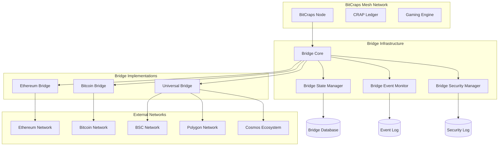
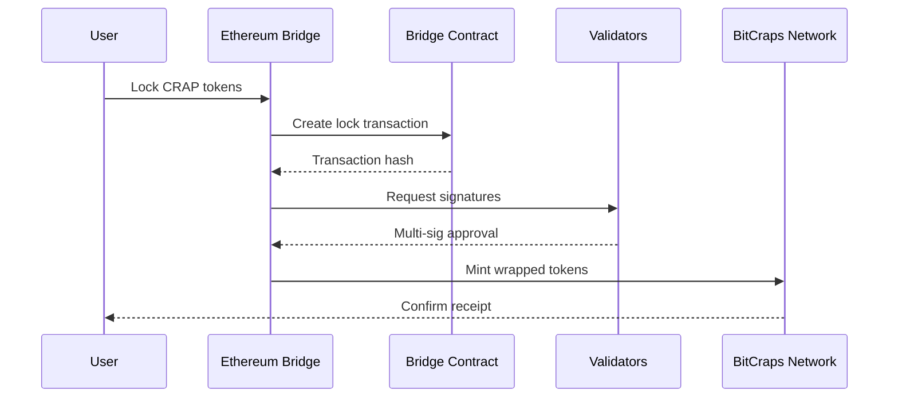
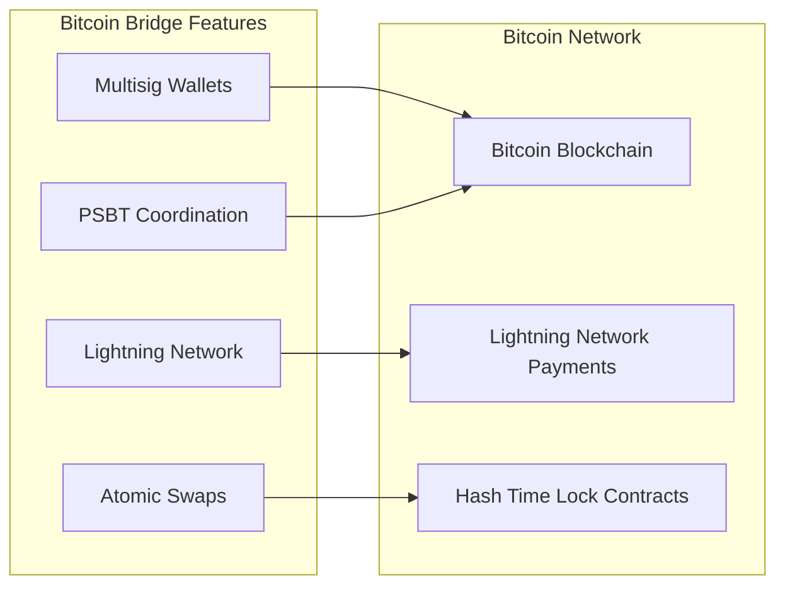
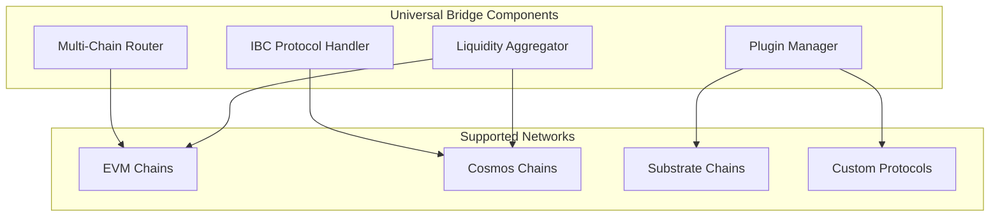
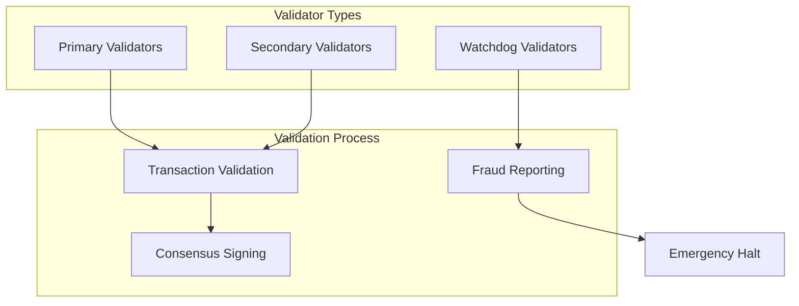
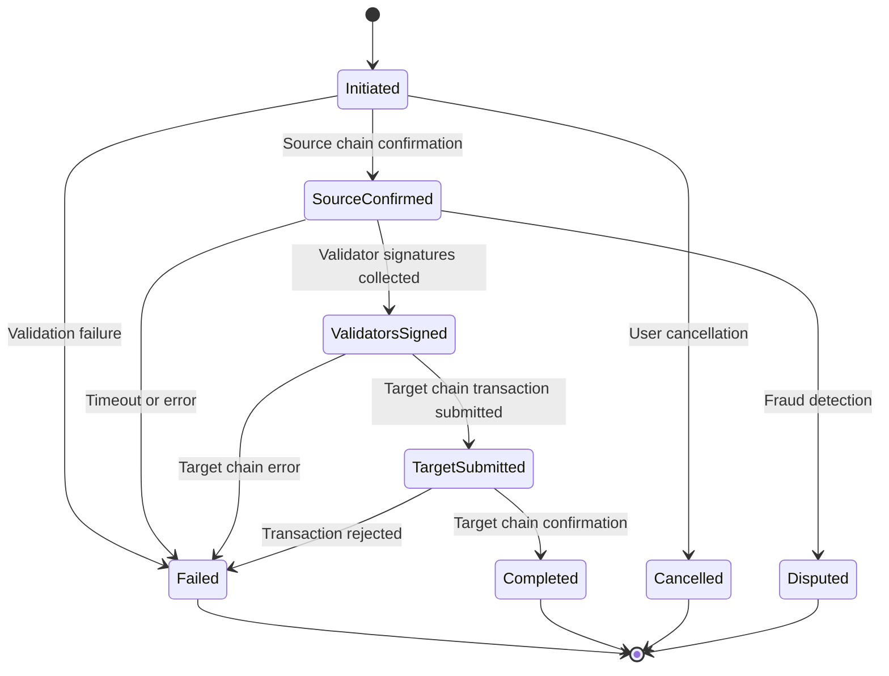

# Cross-Chain Bridge Architecture

## Overview

The BitCraps Cross-Chain Bridge Infrastructure enables seamless interoperability between BitCraps and multiple blockchain networks. This document provides a comprehensive overview of the bridge architecture, implementation details, security measures, and usage guidelines.

## Architecture Overview



## Core Components

### 1. Bridge Core (`src/bridges/mod.rs`)

The bridge core provides the fundamental abstraction layer for all cross-chain operations:

- **Chain Abstraction**: Unified interface for different blockchain types (EVM, UTXO, Cosmos)
- **Transaction Management**: Standardized bridge transaction lifecycle
- **Security Framework**: Multi-signature validation and fraud detection
- **Event System**: Real-time monitoring of cross-chain events

#### Key Features:

- **Universal Chain Support**: Supports EVM chains (Ethereum, BSC, Polygon), UTXO chains (Bitcoin), and Cosmos ecosystem
- **Security-First Design**: Multiple validation layers and fraud detection
- **High Availability**: Redundant validators and failover mechanisms
- **Extensible Architecture**: Plugin system for adding new blockchain support

### 2. Ethereum Bridge (`src/bridges/ethereum.rs`)

Production-ready bridge for Ethereum Virtual Machine compatible chains:



#### Supported Operations:

- **Token Locking**: Lock CRAP tokens on Ethereum for bridging to BitCraps
- **Token Minting**: Mint wrapped CRAP (wCRAP) tokens on Ethereum
- **Smart Contract Integration**: Automated bridge operations via smart contracts
- **Gas Optimization**: EIP-1559 support with dynamic fee calculation
- **Event Monitoring**: Real-time detection of bridge events

#### Security Features:

- **Multi-signature Validation**: Requires threshold signatures from trusted validators
- **Time-locked Operations**: Delay mechanisms for large transactions
- **Emergency Pause**: Circuit breaker for security incidents
- **Slashing Conditions**: Economic penalties for malicious validators

### 3. Bitcoin Bridge (`src/bridges/bitcoin.rs`)

Advanced Bitcoin integration with Lightning Network and atomic swaps:



#### Key Capabilities:

- **Multisig Security**: M-of-N multisig wallets for secure Bitcoin custody
- **PSBT Support**: Partially Signed Bitcoin Transactions for coordinator-less signing
- **Lightning Integration**: Fast, low-cost payments via Lightning Network
- **Atomic Swaps**: Trustless Bitcoin ↔ CRAP exchanges
- **UTXO Management**: Efficient handling of Bitcoin's UTXO model

### 4. Universal Bridge (`src/bridges/universal.rs`)

Advanced bridge protocol supporting multiple blockchain ecosystems:

#### Features:

- **IBC Protocol**: Inter-Blockchain Communication for Cosmos ecosystem
- **Cross-Chain Messaging**: Generic message passing between chains
- **Liquidity Aggregation**: Optimal routing through multiple liquidity sources
- **Plugin Architecture**: Extensible support for new blockchain protocols



## Security Architecture

### Multi-Layer Security Model

1. **Input Validation Layer**
   - Address format validation
   - Amount bounds checking
   - Signature verification

2. **Fraud Detection Layer**
   - Pattern recognition
   - Anomaly detection
   - Risk scoring

3. **Consensus Layer**
   - Multi-signature validation
   - Threshold cryptography
   - Byzantine fault tolerance

4. **Monitoring Layer**
   - Real-time event detection
   - Security incident response
   - Automated alerting

### Validator Network



### Emergency Procedures

- **Circuit Breaker**: Automatic halt on suspicious activity
- **Emergency Pause**: Manual bridge suspension by governance
- **Recovery Procedures**: Systematic restoration of bridge operations
- **Incident Response**: Coordinated response to security events

## Bridge Transaction Lifecycle

### Standard Bridge Flow



### Transaction States

1. **Initiated**: Transaction created and validated
2. **SourceConfirmed**: Source chain transaction confirmed
3. **ValidatorsSigned**: Sufficient validator signatures collected
4. **TargetSubmitted**: Target chain transaction submitted
5. **Completed**: Bridge operation successfully completed
6. **Failed**: Transaction failed at any stage
7. **Cancelled**: User-initiated cancellation
8. **Disputed**: Flagged by fraud detection

## API Usage Examples

### Ethereum Bridge Example

```rust
use bitcraps::bridges::ethereum::*;
use bitcraps::bridges::*;

// Create Ethereum bridge
let config = EthereumBridgeConfig {
    rpc_endpoint: "https://mainnet.infura.io/v3/YOUR-PROJECT-ID".to_string(),
    bridge_contract_address: "0x742d35Cc...".to_string(),
    token_contract_address: "0x123456...".to_string(),
    gas_price: 20_000_000_000, // 20 gwei
    confirmation_blocks: 12,
    chain_id: 1, // Mainnet
    ..Default::default()
};

let bridge = EthereumBridge::new(config);

// Initialize bridge
let bridge_config = BridgeConfig {
    min_amount: 1000,
    max_amount: 1_000_000_000,
    fee_percentage: 0.001, // 0.1%
    required_signatures: 3,
    timeout_duration: Duration::from_secs(3600),
    ..Default::default()
};

bridge.initialize(bridge_config).await?;

// Create bridge transaction
let transaction = BridgeTransaction {
    tx_id: generate_tx_id(),
    source_chain: ChainId::Ethereum,
    target_chain: ChainId::BitCraps,
    token_address: "0x123456...".to_string(),
    amount: 1_000_000, // 1 CRAP
    sender: "0xUser...".to_string(),
    recipient: "bitcraps_address".to_string(),
    ..Default::default()
};

// Initiate bridge operation
let bridge_tx_id = bridge.initiate_bridge(&transaction).await?;
```

### Bitcoin Bridge Example

```rust
use bitcraps::bridges::bitcoin::*;

// Create Bitcoin bridge with Lightning support
let config = BitcoinBridgeConfig {
    network: BitcoinNetwork::Mainnet,
    min_confirmations: 6,
    multisig_threshold: 2,
    lightning_config: Some(LightningConfig {
        node_endpoint: "127.0.0.1:9735".to_string(),
        bridge_channel_capacity: 16_777_216, // ~0.167 BTC
        ..Default::default()
    }),
    ..Default::default()
};

let bridge = BitcoinBridge::new(config);

// Create multisig wallet
let validator_pubkeys = vec![
    "03abc123...".to_string(),
    "03def456...".to_string(),
    "03ghi789...".to_string(),
];

let wallet_id = bridge.create_multisig_wallet(
    validator_pubkeys,
    2 // 2-of-3 multisig
).await?;

// Create atomic swap
let swap_id = bridge.create_atomic_swap(
    1_000_000, // 0.01 BTC
    10_000_000_000, // 10 CRAP
    "bc1qUser...".to_string(),
    bitcraps_participant_id,
).await?;

// Lock Bitcoin side
let contract_tx = bridge.lock_bitcoin_atomic_swap(&swap_id).await?;
```

### Universal Bridge Example

```rust
use bitcraps::bridges::universal::*;

let config = UniversalBridgeConfig::default();
let bridge = UniversalBridge::new(config);

// Send cross-chain message
let message_id = bridge.send_cross_chain_message(
    ChainId::Ethereum,
    ChainId::Cosmos,
    "token_transfer".to_string(),
    transfer_payload,
    "eth_sender_address".to_string(),
    "cosmos_recipient_address".to_string(),
).await?;

// Find optimal route
let route = bridge.find_optimal_route(
    &ChainId::Bitcoin,
    &ChainId::Polygon,
    amount,
).await?;

println!("Optimal route: {} hops, cost: {}, time: {:?}",
    route.hops.len(),
    route.total_cost,
    route.estimated_time
);
```

## Configuration and Deployment

### Environment Configuration

```toml
[features]
# Enable all bridge implementations
bridges = ["ethereum", "bitcoin", "web3"]

# Enable specific bridges
bridge-ethereum = ["ethereum"]
bridge-bitcoin = ["bitcoin"]  
bridge-universal = ["bridges"]

# Blockchain support
ethereum = ["dep:ethers"]
bitcoin = ["dep:bitcoin"]
web3 = ["dep:web3"]
```

### Production Deployment

1. **Validator Setup**
   - Deploy validator nodes across geographically distributed locations
   - Configure hardware security modules (HSMs) for key management
   - Set up monitoring and alerting systems

2. **Bridge Contracts**
   - Deploy bridge contracts on target chains
   - Verify contract source code on block explorers
   - Configure multi-signature wallets for contract administration

3. **Monitoring Infrastructure**
   - Real-time transaction monitoring
   - Security event detection
   - Performance metrics collection
   - Automated incident response

### Security Best Practices

1. **Key Management**
   - Use hardware security modules for validator keys
   - Implement key rotation procedures
   - Maintain secure key backup systems

2. **Validator Operations**
   - Run validators in secure, isolated environments
   - Implement monitoring for validator performance
   - Establish clear governance procedures

3. **Bridge Operations**
   - Regular security audits of bridge contracts
   - Penetration testing of bridge infrastructure
   - Bug bounty programs for vulnerability disclosure

## Performance and Scalability

### Transaction Throughput

- **Ethereum Bridge**: 100-200 TPS (limited by Ethereum block time)
- **Bitcoin Bridge**: 10-50 TPS (limited by Bitcoin block time)
- **Lightning Bridge**: 1000+ TPS (off-chain payments)
- **Universal Bridge**: Varies by route complexity

### Latency Characteristics

- **Fast Finality**: Cosmos chains (1-3 seconds)
- **Standard Finality**: Ethereum (2-5 minutes)
- **Slow Finality**: Bitcoin (30-60 minutes)
- **Instant**: Lightning Network (< 1 second)

### Scalability Solutions

1. **Layer 2 Integration**
   - Support for Ethereum L2s (Arbitrum, Optimism, Polygon)
   - Lightning Network for Bitcoin scalability
   - IBC for Cosmos ecosystem scalability

2. **Batching and Aggregation**
   - Transaction batching for reduced costs
   - Liquidity aggregation across multiple pools
   - Route optimization for multi-hop transfers

## Monitoring and Observability

### Metrics Collection

```rust
// Example metrics for bridge monitoring
pub struct BridgeStatistics {
    pub total_transactions: u64,
    pub completed_transactions: u64,
    pub failed_transactions: u64,
    pub total_volume: CrapTokens,
    pub average_fee: f64,
    pub average_completion_time: u64,
    pub supported_chains: u8,
    pub active_validators: u8,
    pub recent_security_events: u32,
}
```

### Key Performance Indicators (KPIs)

- **Success Rate**: Percentage of successfully completed transactions
- **Average Completion Time**: Time from initiation to completion
- **Transaction Volume**: Total value bridged across all chains
- **Security Events**: Number and severity of security incidents
- **Validator Uptime**: Availability of validator network

### Alerting and Incident Response

- **Real-time Alerts**: Immediate notification of security events
- **Automated Responses**: Circuit breakers and emergency pauses
- **Escalation Procedures**: Clear escalation paths for different incident types
- **Post-incident Analysis**: Comprehensive review and improvement process

## Testing and Quality Assurance

### Test Coverage

The bridge infrastructure includes comprehensive test suites:

1. **Unit Tests**: Individual component testing
2. **Integration Tests**: End-to-end bridge flows
3. **Security Tests**: Fraud detection and validation
4. **Performance Tests**: Load testing under high throughput
5. **Chaos Engineering**: Failure scenario testing

### Test Execution

```bash
# Run all bridge tests
cargo test --features bridges

# Run specific bridge tests
cargo test --features bridge-ethereum test_ethereum_bridge
cargo test --features bridge-bitcoin test_bitcoin_bridge

# Run security tests
cargo test test_fraud_detection_system
cargo test test_bridge_security_manager

# Run performance tests
cargo test test_bridge_performance
```

## Roadmap and Future Development

### Phase 1: Core Infrastructure (Completed)
- ✅ Bridge core abstraction layer
- ✅ Ethereum bridge implementation
- ✅ Bitcoin bridge with Lightning support
- ✅ Universal bridge with IBC protocol

### Phase 2: Enhanced Security (In Progress)
- 🔄 Advanced fraud detection algorithms
- 🔄 Hardware security module integration
- 🔄 Formal verification of bridge contracts
- 🔄 Multi-party computation for key management

### Phase 3: Advanced Features (Planned)
- 📋 Zero-knowledge proof integration
- 📋 Cross-chain governance mechanisms
- 📋 Automated market making for bridge liquidity
- 📋 Privacy-preserving bridge operations

### Phase 4: Ecosystem Expansion (Future)
- 📋 Support for additional blockchain networks
- 📋 Developer SDK for custom bridge implementations
- 📋 Decentralized bridge governance
- 📋 Cross-chain gaming infrastructure

## Contributing

### Development Setup

1. **Prerequisites**
   ```bash
   # Install Rust
   curl --proto '=https' --tlsv1.2 -sSf https://sh.rustup.rs | sh
   
   # Install required tools
   cargo install cargo-audit cargo-outdated
   ```

2. **Build with Bridge Support**
   ```bash
   # Clone repository
   git clone https://github.com/bitcraps/bitchat-rust
   cd bitchat-rust
   
   # Build with all bridges
   cargo build --features bridges
   
   # Run tests
   cargo test --features bridges
   ```

### Code Contributions

1. **Fork the repository**
2. **Create feature branch**: `git checkout -b feature/bridge-enhancement`
3. **Implement changes** with comprehensive tests
4. **Run security audits**: `cargo audit`
5. **Submit pull request** with detailed description

### Security Disclosures

For security vulnerabilities in bridge infrastructure:
- **Email**: security@bitcraps.org
- **PGP Key**: [Available on our website]
- **Response Time**: Within 24 hours
- **Bug Bounty**: Available for critical vulnerabilities

## License

This bridge infrastructure is licensed under MIT OR Apache-2.0, consistent with the BitCraps project licensing.

## Support and Documentation

- **API Documentation**: Generated with `cargo doc --features bridges`
- **Community Discord**: [Join our Discord server]
- **GitHub Issues**: Report bugs and request features
- **Developer Forum**: Technical discussions and Q&A

---

*This documentation reflects the current state of the BitCraps Cross-Chain Bridge Infrastructure. For the latest updates and changes, please refer to the project repository.*