# BitCraps Infrastructure & DevOps Implementation Plan

## Executive Summary

Based on analysis of the existing codebase and infrastructure, this document provides a comprehensive implementation plan to achieve production-grade infrastructure, deployment pipelines, and observability for the BitCraps protocol. The plan addresses gaps in current infrastructure while building upon existing strengths.

### Current Infrastructure Assessment

**Existing Strengths:**
- ✅ Comprehensive CI/CD pipelines (GitHub Actions)
- ✅ Multi-platform build support (Linux, macOS, Windows, Android, iOS)
- ✅ Security scanning workflows (SAST, dependency audit, secret detection)
- ✅ Infrastructure as Code (Terraform with EKS)
- ✅ Kubernetes deployment with Helm charts
- ✅ Production-ready Docker configuration
- ✅ Sophisticated monitoring system with Prometheus metrics
- ✅ Multi-environment configuration management

**Critical Gaps:**
- ⚠️ Limited staging environment validation
- ⚠️ No automated performance benchmarking in CI
- ⚠️ Missing centralized logging aggregation
- ⚠️ Incomplete backup and disaster recovery procedures
- ⚠️ No automated scaling policies
- ⚠️ Limited observability dashboards and alerting
- ⚠️ Incomplete secrets management automation

---

## 1. CI/CD Pipeline Enhancement

### 1.1 Current State Analysis

The existing CI/CD pipeline includes:
- Multi-OS testing (Ubuntu, macOS, Windows)
- Mobile platform builds (Android, iOS)
- Security scanning (cargo-audit, semgrep, TruffleHog)
- Code coverage with Codecov
- Performance benchmarks (master branch only)
- Release artifact generation

### 1.2 Enhanced CI/CD Architecture

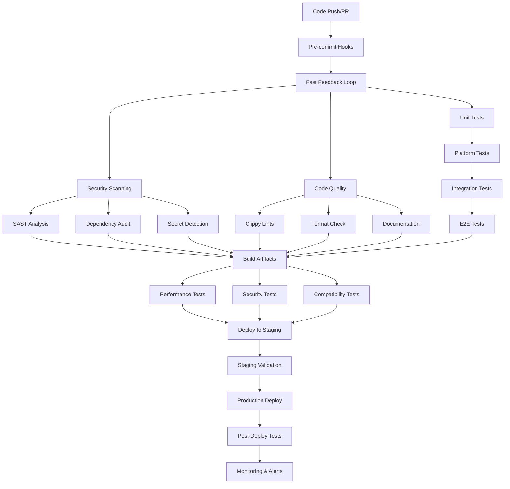

### 1.3 Implementation Requirements

#### 1.3.1 Enhanced GitHub Actions Workflows

**Infrastructure Cost**: $50-200/month for GitHub Actions compute

**New Workflows Required:**

1. **Enhanced Testing Pipeline** (`enhanced-test.yml`)
   ```yaml
   # Performance regression detection
   - name: Performance Benchmarks
     run: |
       cargo bench --features benchmarks > benchmarks.txt
       ./scripts/compare-benchmarks.sh baseline.txt benchmarks.txt
   
   # Memory leak detection
   - name: Memory Leak Tests
     run: |
       cargo test --features memory-profiling
       valgrind --tool=memcheck ./target/debug/bitcraps
   
   # Load testing
   - name: Load Tests
     run: |
       ./scripts/setup-test-cluster.sh
       ./scripts/run-load-tests.sh 1000 concurrent_users
   ```

2. **Staging Deployment Pipeline** (`staging-deploy.yml`)
   ```yaml
   # Automated staging deployment
   - name: Deploy to Staging
     run: |
       ./scripts/deploy.sh staging
       ./scripts/run-smoke-tests.sh staging
       ./scripts/validate-metrics.sh staging 5min
   
   # Integration testing against staging
   - name: E2E Tests
     run: |
       ./tests/e2e/run-full-suite.sh staging
       ./tests/e2e/chaos-engineering.sh staging
   ```

3. **Multi-Environment Matrix** (`matrix-test.yml`)
   ```yaml
   strategy:
     matrix:
       environment: [dev, staging, prod-like]
       rust: [stable, beta]
       features: [default, mobile, server]
   ```

#### 1.3.2 Build Optimization

**Current Build Time**: ~15-20 minutes
**Target Build Time**: <10 minutes

**Optimizations:**
- Implement incremental builds with smart caching
- Parallelize cross-platform builds
- Use build matrix optimization
- Pre-built base images for common dependencies

```bash
# Build cache strategy
CACHE_KEY="${{ runner.os }}-${{ matrix.rust }}-${{ hashFiles('Cargo.lock') }}"
RESTORE_KEYS="${{ runner.os }}-${{ matrix.rust }}-"
```

### 1.4 Automated Deployment Strategy

#### 1.4.1 Deployment Environments

| Environment | Purpose | Deployment Trigger | Validation |
|-------------|---------|-------------------|------------|
| **Development** | Feature development | Manual/PR | Unit tests, lint |
| **Staging** | Pre-production testing | Merge to develop | Full E2E suite |
| **Production** | Live system | Tagged release | Staged rollout |

#### 1.4.2 Deployment Process

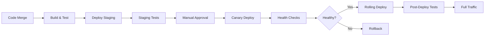

**Infrastructure Requirements:**
- EKS clusters for each environment
- Application Load Balancer with health checks
- Blue-green deployment capability
- Automated rollback triggers

**Cost Estimate:**
- Development: $200/month
- Staging: $500/month  
- Production: $2,000-5,000/month (depending on scale)

---

## 2. Configuration Management & Secrets

### 2.1 Current State

Existing configuration system:
- TOML-based configuration files
- Environment variable overrides
- Basic Kubernetes secrets
- Manual secret creation

### 2.2 Enhanced Configuration Architecture

#### 2.2.1 Configuration Hierarchy

```
Configuration Priority (highest to lowest):
1. Command line arguments
2. Environment variables
3. Environment-specific config files
4. Default configuration
5. Built-in defaults
```

#### 2.2.2 Multi-Environment Configuration

**Directory Structure:**
```
config/
├── defaults.toml           # Base configuration
├── development.toml        # Dev overrides
├── staging.toml           # Staging overrides  
├── production.toml        # Production overrides
├── local.toml            # Local dev (gitignored)
└── schema.json           # Configuration validation
```

**Configuration Validation Schema:**
```toml
[network]
listen_port = { type = "integer", min = 1024, max = 65535, required = true }
max_connections = { type = "integer", min = 1, max = 10000, default = 100 }
enable_tls = { type = "boolean", required = true }

[database]
url = { type = "string", pattern = "^(sqlite|postgresql)://", required = true }
max_connections = { type = "integer", min = 1, max = 100, default = 10 }

[security]
pow_difficulty = { type = "integer", min = 4, max = 24, default = 12 }
enable_rate_limiting = { type = "boolean", default = true }
```

### 2.3 Advanced Secrets Management

#### 2.3.1 Secrets Architecture

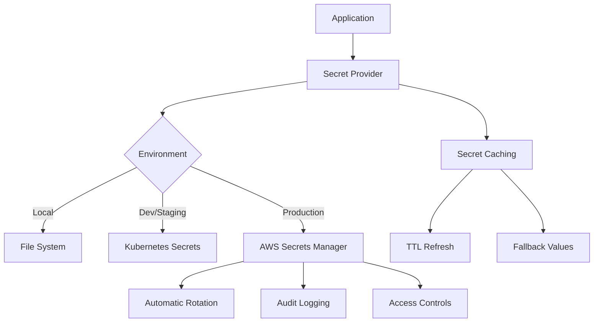

#### 2.3.2 Implementation Plan

**Phase 1: Enhanced Kubernetes Secrets** (Week 1-2)
```yaml
# Enhanced secret management
apiVersion: v1
kind: Secret
metadata:
  name: bitcraps-secrets
  annotations:
    kubernetes.io/managed-by: external-secrets-operator
    secret.kubernetes.io/rotation-schedule: "0 2 * * 0"  # Weekly
type: Opaque
data:
  database-password: <base64-encoded>
  jwt-secret: <base64-encoded>
  encryption-key: <base64-encoded>
```

**Phase 2: External Secrets Integration** (Week 3-4)
```yaml
# External Secrets Operator configuration
apiVersion: external-secrets.io/v1beta1
kind: SecretStore
metadata:
  name: aws-secrets-manager
spec:
  provider:
    aws:
      service: SecretsManager
      region: us-west-2
      auth:
        jwt:
          serviceAccountRef:
            name: external-secrets-sa
```

**Phase 3: Automatic Secret Rotation** (Week 5-6)
- Database credentials rotation
- API keys and tokens refresh
- TLS certificate renewal
- Encryption key rotation

#### 2.3.3 Secret Categories & Management

| Secret Type | Storage Method | Rotation Frequency | Access Pattern |
|-------------|---------------|-------------------|----------------|
| Database Credentials | AWS Secrets Manager | Weekly | Automatic refresh |
| API Keys | Kubernetes Secrets | Monthly | Manual rotation |
| TLS Certificates | cert-manager | 30 days | Automatic renewal |
| Encryption Keys | Hardware HSM | Yearly | Manual rotation |
| JWT Secrets | Kubernetes Secrets | Quarterly | Automatic refresh |

### 2.4 Configuration Deployment

#### 2.4.1 GitOps Configuration Management

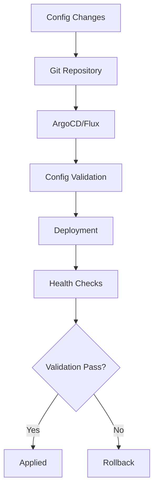

**Implementation Requirements:**
- ArgoCD or Flux for GitOps
- Configuration validation webhooks
- Automated rollback capabilities
- Change tracking and audit logs

**Infrastructure Cost**: $100-300/month for GitOps tooling

---

## 3. Logging & Monitoring Infrastructure

### 3.1 Current Monitoring Capabilities

**Existing Strengths:**
- Comprehensive metrics collection (Prometheus format)
- System monitoring across platforms
- Error tracking and categorization
- Health check endpoints
- Performance metrics

**Identified Gaps:**
- No centralized log aggregation
- Limited alerting rules
- No distributed tracing
- Missing SLO/SLI definitions
- Insufficient dashboard coverage

### 3.2 Comprehensive Observability Stack

#### 3.2.1 Three Pillars of Observability

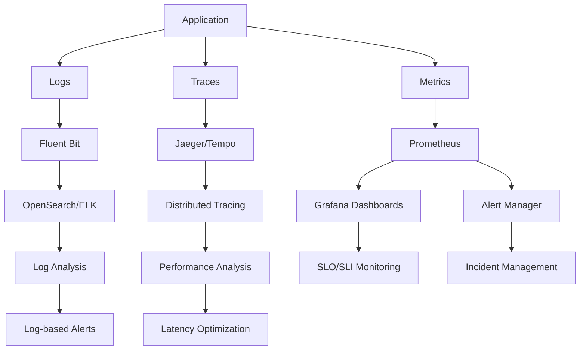

#### 3.2.2 Enhanced Metrics Collection

**Metrics Categories & SLIs:**

1. **Golden Signals (SLIs)**
   ```rust
   // Latency
   histogram!(
       "bitcraps_request_duration_seconds",
       duration.as_secs_f64(),
       "method" => method,
       "status" => status.to_string()
   );
   
   // Traffic
   counter!(
       "bitcraps_requests_total", 
       "method" => method,
       "endpoint" => endpoint
   );
   
   // Errors
   counter!(
       "bitcraps_errors_total",
       "type" => error_type,
       "severity" => severity
   );
   
   // Saturation
   gauge!(
       "bitcraps_resource_utilization_percent",
       utilization,
       "resource" => resource_type
   );
   ```

2. **Business Metrics**
   ```rust
   // Game-specific metrics
   counter!("bitcraps_games_completed_total", "outcome" => outcome);
   histogram!("bitcraps_game_duration_seconds", duration);
   gauge!("bitcraps_active_players", player_count);
   counter!("bitcraps_bets_placed_total", "bet_type" => bet_type);
   ```

3. **Infrastructure Metrics**
   ```rust
   // Network mesh metrics
   gauge!("bitcraps_mesh_peers_connected", peer_count);
   counter!("bitcraps_mesh_messages_total", "type" => msg_type);
   histogram!("bitcraps_consensus_latency_seconds", latency);
   ```

### 3.3 Centralized Logging Architecture

#### 3.3.1 Log Aggregation Pipeline

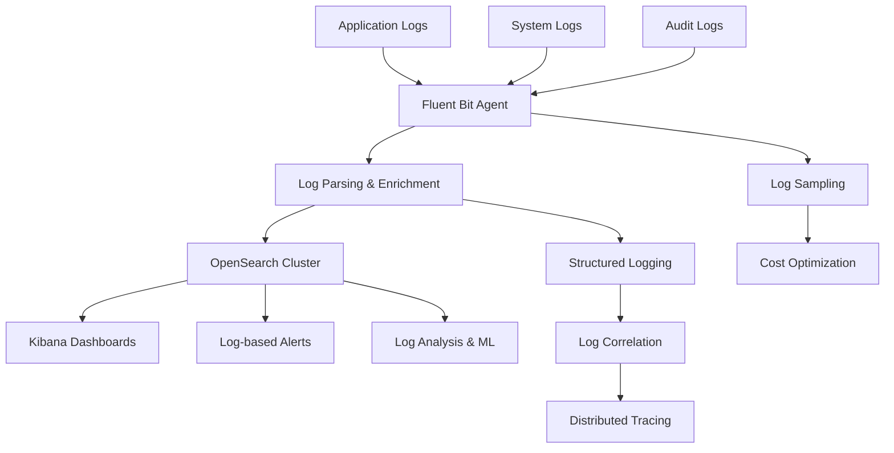

#### 3.3.2 Structured Logging Implementation

**Enhanced Logging Configuration:**
```rust
use tracing::{info, error, warn, debug, span, Level};
use tracing_subscriber::{
    layer::SubscriberExt,
    util::SubscriberInitExt,
    fmt, EnvFilter, Registry,
};

// Production logging setup
pub fn setup_logging(env: &str) -> Result<(), Box<dyn std::error::Error>> {
    let fmt_layer = fmt::layer()
        .with_target(true)
        .with_thread_ids(true)
        .with_file(env != "production")  // Disable file info in prod
        .with_line_number(env != "production");
    
    let filter_layer = EnvFilter::try_from_default_env()
        .or_else(|_| EnvFilter::try_new("bitcraps=info,warn"))
        .unwrap();
    
    // Add structured fields for searchability
    Registry::default()
        .with(filter_layer)
        .with(fmt_layer)
        .with(tracing_opentelemetry::layer())  // For distributed tracing
        .init();
    
    Ok(())
}

// Structured logging with correlation IDs
#[tracing::instrument(
    skip(self),
    fields(
        game_id = %game_id,
        player_id = %player.id(),
        bet_amount = bet.amount(),
        trace_id = tracing::Span::current().id()
    )
)]
async fn place_bet(&self, game_id: GameId, player: &Player, bet: Bet) -> Result<(), GameError> {
    info!("Processing bet placement");
    
    // Structured error logging
    if let Err(e) = self.validate_bet(&bet) {
        error!(
            error = %e,
            error_code = e.code(),
            "Bet validation failed"
        );
        return Err(e);
    }
    
    info!("Bet placed successfully");
    Ok(())
}
```

### 3.4 Alerting & Incident Management

#### 3.4.1 Alert Hierarchy

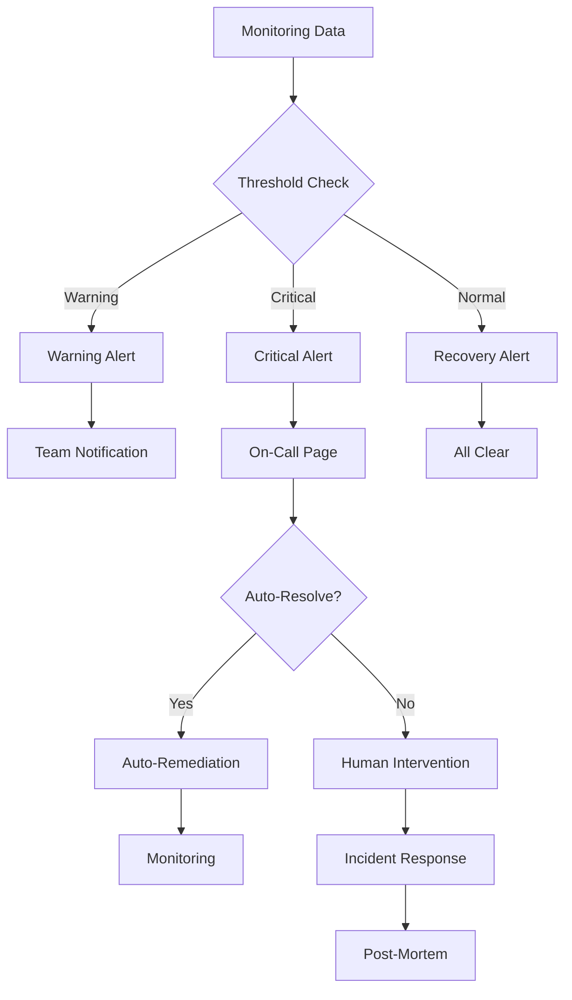

#### 3.4.2 SLO-Based Alerting

**Service Level Objectives:**
```yaml
slos:
  - name: api_availability
    description: "API should be available 99.9% of the time"
    target: 0.999
    window: 30d
    
  - name: consensus_latency
    description: "Consensus decisions within 5 seconds"
    target: 0.95  # 95th percentile
    window: 1h
    threshold: 5s
    
  - name: game_completion_rate
    description: "Games should complete successfully 99.5% of the time"
    target: 0.995
    window: 24h

alerts:
  - name: SLO_Burn_Rate_High
    expr: |
      (
        sum(rate(bitcraps_requests_total{code=~"5.."}[1m])) /
        sum(rate(bitcraps_requests_total[1m]))
      ) > 0.01  # 1% error rate burns 99.9% SLO quickly
    for: 5m
    severity: critical
    
  - name: Consensus_Latency_High
    expr: |
      histogram_quantile(0.95, 
        rate(bitcraps_consensus_latency_seconds_bucket[5m])
      ) > 5
    for: 2m
    severity: warning
```

### 3.5 Distributed Tracing

#### 3.5.1 Tracing Implementation

**OpenTelemetry Integration:**
```rust
use opentelemetry::{trace::Tracer, global, KeyValue};
use tracing_opentelemetry::OpenTelemetrySpanExt;

#[tracing::instrument(skip(self))]
async fn process_game_round(&self, game_id: GameId) -> Result<RoundResult, GameError> {
    let span = tracing::Span::current();
    span.set_attribute("game.id", game_id.to_string());
    
    // Child span for consensus
    let consensus_result = {
        let _span = span.enter();
        self.consensus_engine.process_round(game_id).await?
    };
    
    span.set_attribute("consensus.duration_ms", consensus_result.duration_ms);
    span.set_attribute("consensus.participants", consensus_result.participant_count);
    
    Ok(consensus_result)
}
```

**Infrastructure Requirements:**
- Jaeger or Tempo for trace collection
- OpenTelemetry collectors
- Trace sampling configuration
- Cross-service correlation

**Cost**: $200-500/month for tracing infrastructure

---

## 4. Deployment Strategy & Environment Management

### 4.1 Current Deployment Architecture

**Existing Setup:**
- Kubernetes deployment with Helm
- Multi-stage Docker builds
- Basic health checks
- Manual deployment script

**Identified Improvements:**
- Implement progressive delivery
- Add automated canary deployments
- Enhance rollback procedures
- Improve environment parity

### 4.2 Progressive Delivery Implementation

#### 4.2.1 Deployment Strategies

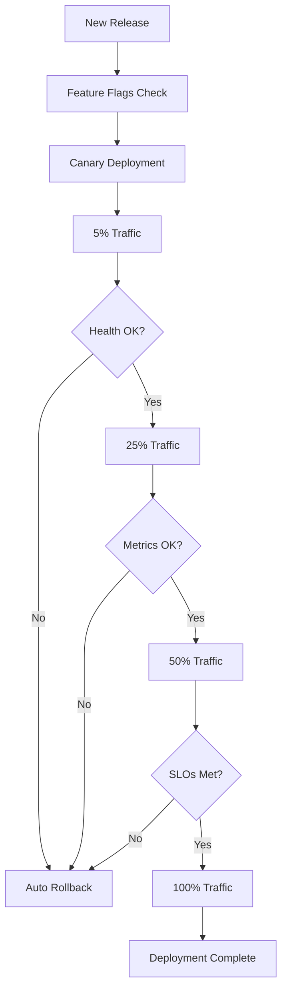

#### 4.2.2 Canary Deployment Configuration

**Argo Rollouts Configuration:**
```yaml
apiVersion: argoproj.io/v1alpha1
kind: Rollout
metadata:
  name: bitcraps
spec:
  replicas: 10
  strategy:
    canary:
      # Analysis and promotion
      analysis:
        templates:
        - templateName: success-rate
        args:
        - name: service-name
          value: bitcraps
      steps:
      - setWeight: 5
      - pause: {duration: 5m}
      - setWeight: 25  
      - pause: {duration: 10m}
      - setWeight: 50
      - pause: {duration: 15m}
      - setWeight: 100
      
      # Automatic rollback triggers  
      scaleDownDelaySeconds: 600
      abortScaleDownDelaySeconds: 600
      
  selector:
    matchLabels:
      app: bitcraps
  template:
    metadata:
      labels:
        app: bitcraps
    spec:
      containers:
      - name: bitcraps
        image: bitcraps:latest
        ports:
        - containerPort: 8080
```

**Analysis Template:**
```yaml
apiVersion: argoproj.io/v1alpha1
kind: AnalysisTemplate
metadata:
  name: success-rate
spec:
  args:
  - name: service-name
  metrics:
  - name: success-rate
    interval: 2m
    count: 5
    successCondition: result[0] >= 0.95
    failureLimit: 2
    provider:
      prometheus:
        address: http://prometheus:9090
        query: |
          sum(
            rate(http_requests_total{service="{{args.service-name}}",status!~"5.."}[2m])
          ) /
          sum(
            rate(http_requests_total{service="{{args.service-name}}"}[2m])
          )
```

### 4.3 Environment Management Strategy

#### 4.3.1 Environment Specifications

| Environment | Purpose | Infrastructure | Data | Monitoring |
|-------------|---------|---------------|------|------------|
| **Local** | Development | Docker Compose | SQLite | Basic logs |
| **Development** | Feature branches | Minimal EKS | Test data | Full metrics |
| **Staging** | Pre-production testing | Production-like EKS | Anonymized prod data | Full observability |
| **Production** | Live system | High availability EKS | Live data | Full observability + alerts |

#### 4.3.2 Infrastructure as Code

**Enhanced Terraform Structure:**
```
terraform/
├── environments/
│   ├── development/
│   │   ├── main.tf
│   │   ├── variables.tf
│   │   └── terraform.tfvars
│   ├── staging/
│   │   ├── main.tf
│   │   ├── variables.tf
│   │   └── terraform.tfvars
│   └── production/
│       ├── main.tf
│       ├── variables.tf
│       └── terraform.tfvars
├── modules/
│   ├── eks-cluster/
│   ├── monitoring/
│   ├── security/
│   └── networking/
└── shared/
    ├── backend.tf
    └── providers.tf
```

**Environment-Specific Configurations:**
```hcl
# environments/production/terraform.tfvars
environment = "production"

# High availability configuration
eks_node_group_min_size = 5
eks_node_group_max_size = 50
eks_node_group_desired_size = 10

# Production-grade instances
eks_node_instance_types = ["m5.2xlarge", "m5.4xlarge"]

# Enhanced monitoring
enable_monitoring = true
monitoring_retention_days = 90

# Security hardening
enable_waf = true
enable_guardduty = true
enable_secrets_rotation = true

# Backup configuration  
backup_retention_days = 90
backup_schedule = "0 2 * * *"  # Daily at 2 AM

# RDS configuration
rds_instance_class = "db.r6g.2xlarge"
rds_multi_az = true
rds_backup_retention = 30

# Redis configuration
redis_node_type = "cache.r6g.2xlarge"
redis_num_cache_nodes = 3
redis_automatic_failover = true
```

### 4.4 Disaster Recovery & Business Continuity

#### 4.4.1 RTO/RPO Targets

| Component | RTO Target | RPO Target | Recovery Strategy |
|-----------|------------|------------|------------------|
| Application Services | 15 minutes | 1 minute | Multi-AZ deployment |
| Database | 30 minutes | 5 minutes | RDS Multi-AZ + backups |
| Configuration | 5 minutes | 0 | GitOps sync |
| Secrets | 10 minutes | 0 | Multi-region replication |
| Monitoring | 20 minutes | 1 hour | Infrastructure as Code |

#### 4.4.2 Backup Strategy

```yaml
# CronJob for automated backups
apiVersion: batch/v1
kind: CronJob
metadata:
  name: database-backup
spec:
  schedule: "0 2 * * *"  # Daily at 2 AM
  jobTemplate:
    spec:
      template:
        spec:
          containers:
          - name: backup
            image: bitcraps/backup-utility:latest
            env:
            - name: BACKUP_TYPE
              value: "database"
            - name: S3_BUCKET
              value: "bitcraps-backups-prod"
            - name: RETENTION_DAYS
              value: "90"
            command:
            - "/scripts/backup-database.sh"
          restartPolicy: OnFailure

---
# Application state backup
apiVersion: batch/v1
kind: CronJob  
metadata:
  name: application-backup
spec:
  schedule: "0 3 * * *"  # Daily at 3 AM
  jobTemplate:
    spec:
      template:
        spec:
          containers:
          - name: app-backup
            image: bitcraps/backup-utility:latest
            env:
            - name: BACKUP_TYPE
              value: "application"
            command:
            - "/scripts/backup-application-state.sh"
```

---

## 5. Dependency Management & Security

### 5.1 Current State Assessment

**Existing Security Measures:**
- Cargo audit in CI pipeline
- Semgrep static analysis
- Secret scanning with TruffleHog
- License compliance checking
- Container security scanning (disabled)

### 5.2 Enhanced Dependency Management

#### 5.2.1 Dependency Audit Framework

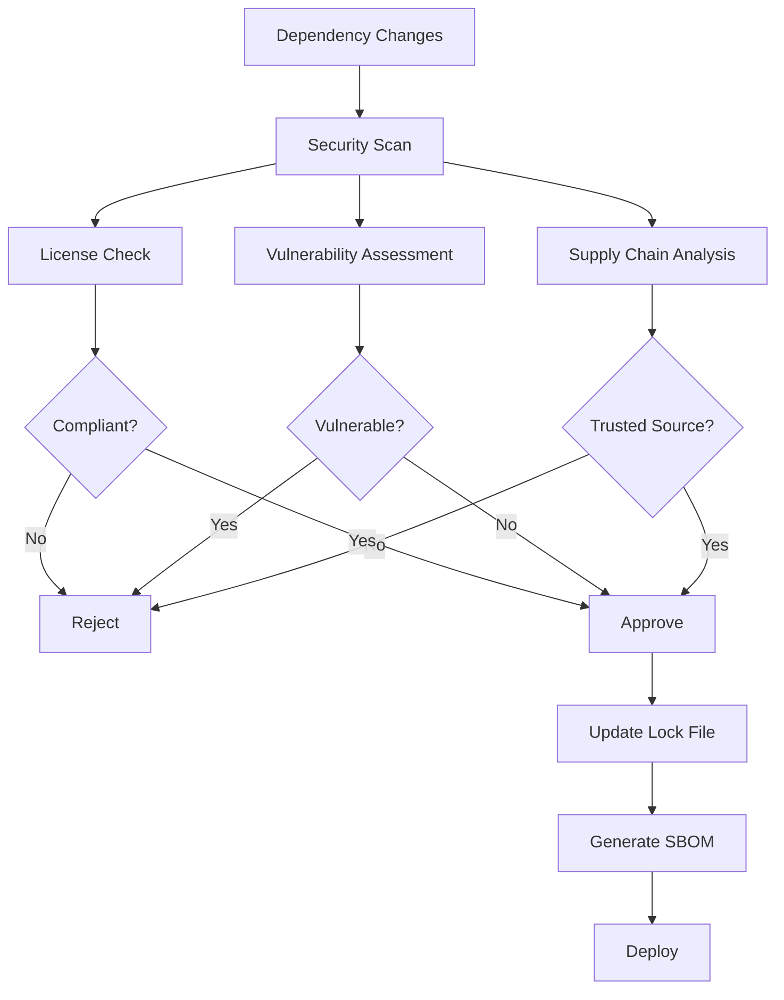

#### 5.2.2 Automated Dependency Management

**Dependabot Configuration:**
```yaml
# .github/dependabot.yml
version: 2
updates:
  - package-ecosystem: "cargo"
    directory: "/"
    schedule:
      interval: "weekly"
      day: "monday"
      time: "09:00"
    reviewers:
      - "security-team"
    assignees:
      - "lead-engineer"
    commit-message:
      prefix: "deps"
      include: "scope"
    
    # Security updates get priority
    open-pull-requests-limit: 20
    
    # Group updates to reduce PR noise
    groups:
      dev-dependencies:
        patterns:
        - "criterion"
        - "tokio-test"
        - "mockall"
      
      crypto-dependencies:
        patterns:
        - "ed25519-dalek"
        - "chacha20poly1305"
        - "argon2"
        - "blake3"
      
      networking-dependencies:
        patterns:
        - "tokio"
        - "hyper"
        - "btleplug"
        - "warp"

    # Version constraints
    ignore:
      - dependency-name: "tokio"
        versions: ["< 1.0", "> 1.999"]
      - dependency-name: "*"
        update-types: ["version-update:semver-major"]
```

#### 5.2.3 Supply Chain Security

**SLSA Framework Implementation:**
```yaml
# .github/workflows/slsa.yml
name: SLSA Provenance Generation
on:
  release:
    types: [published]

jobs:
  provenance:
    permissions:
      actions: read
      id-token: write
      contents: write
    uses: slsa-framework/slsa-github-generator/.github/workflows/generator_generic_slsa3.yml@v1.7.0
    with:
      base64-subjects: "${{ needs.build.outputs.digests }}"
      upload-assets: true
```

**Software Bill of Materials (SBOM):**
```bash
# Generate SBOM for each release
cargo cyclonedx --format json --output-file sbom.json

# Verify SBOM integrity
cosign verify --key cosign.pub sbom.json

# Upload to transparency log
rekor-cli upload --artifact sbom.json --signature sbom.json.sig
```

### 5.3 Security Scanning Enhancement

#### 5.3.1 Multi-Layer Security Scanning

**Enhanced Security Pipeline:**
```yaml
name: Enhanced Security Scanning
on:
  push:
    branches: [main, develop]
  pull_request:
    branches: [main, develop]
  schedule:
    - cron: '0 3 * * *'  # Daily at 3 AM

jobs:
  security-matrix:
    strategy:
      matrix:
        scan-type: [sast, dast, iac, container, secrets, licenses]
        
    steps:
    - name: SAST Scanning
      if: matrix.scan-type == 'sast'
      run: |
        # Multiple SAST tools for comprehensive coverage
        semgrep --config=auto --json --output=semgrep.json .
        cargo clippy -- -D warnings -D clippy::security
        cargo geiger --format json > unsafe-usage.json
        
    - name: DAST Scanning  
      if: matrix.scan-type == 'dast'
      run: |
        # Deploy test instance
        docker run -d -p 8080:8080 bitcraps:test
        
        # Run OWASP ZAP against running instance
        zap-full-scan.py -t http://localhost:8080 -J zap-report.json
        
    - name: Infrastructure Scanning
      if: matrix.scan-type == 'iac'
      run: |
        # Terraform security scanning
        tfsec terraform/ --format json --out terraform-security.json
        
        # Kubernetes manifest scanning
        kubesec scan helm/bitcraps/templates/*.yaml --format json
        
    - name: Container Scanning
      if: matrix.scan-type == 'container'
      run: |
        # Build image
        docker build -t bitcraps:scan .
        
        # Multi-tool container scanning
        trivy image --format json --output trivy.json bitcraps:scan
        snyk container test bitcraps:scan --json > snyk-container.json
        
    - name: Secret Scanning
      if: matrix.scan-type == 'secrets'
      run: |
        # Multiple secret scanners
        trufflehog filesystem . --json > trufflehog.json
        detect-secrets scan --all-files --baseline .secrets.baseline
        gitleaks detect --source . --report gitleaks.json
        
    - name: License Scanning  
      if: matrix.scan-type == 'licenses'
      run: |
        # License compliance
        cargo license --json > licenses.json
        fossa analyze
        licensee detect
```

#### 5.3.2 Vulnerability Management

**Vulnerability Response Process:**
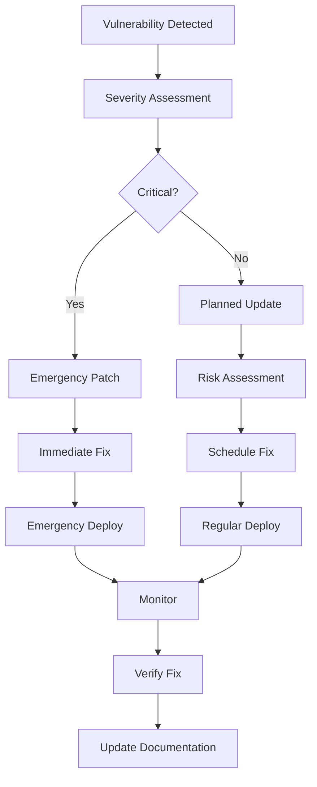

**Automated Vulnerability Response:**
```rust
// Automated vulnerability detection and response
pub struct VulnerabilityManager {
    severity_thresholds: HashMap<Severity, Duration>,
    notification_channels: Vec<NotificationChannel>,
    auto_fix_enabled: bool,
}

impl VulnerabilityManager {
    pub async fn handle_vulnerability(&self, vuln: Vulnerability) -> Result<()> {
        match vuln.severity {
            Severity::Critical => {
                // Immediate response required
                self.send_alert(&vuln).await?;
                if self.auto_fix_enabled {
                    self.attempt_auto_fix(&vuln).await?;
                }
            },
            Severity::High => {
                // 24-hour response window
                self.schedule_fix(&vuln, Duration::from_hours(24)).await?;
            },
            Severity::Medium => {
                // 7-day response window
                self.schedule_fix(&vuln, Duration::from_days(7)).await?;
            },
            Severity::Low => {
                // 30-day response window
                self.schedule_fix(&vuln, Duration::from_days(30)).await?;
            },
        }
        Ok(())
    }
}
```

---

## 6. Performance Optimization & Benchmarking

### 6.1 Current Performance Monitoring

**Existing Capabilities:**
- Basic Criterion benchmarks
- Performance metrics collection
- Resource usage monitoring
- Manual performance testing

### 6.2 Comprehensive Performance Framework

#### 6.2.1 Performance Testing Architecture

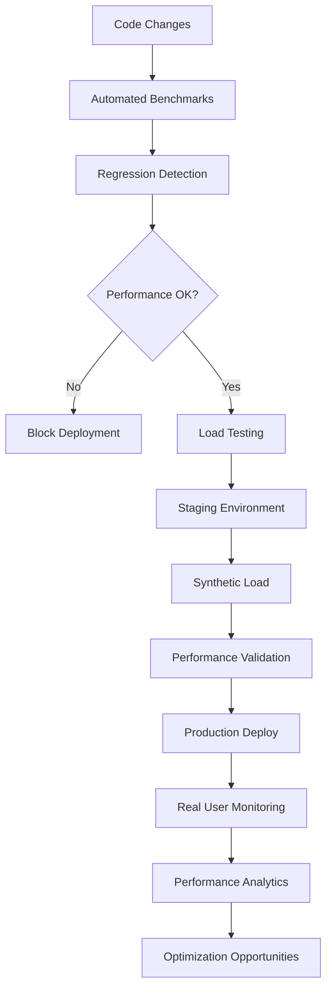

#### 6.2.2 Benchmarking Infrastructure

**Enhanced Benchmark Suite:**
```rust
// Comprehensive benchmark categories
mod benchmarks {
    use criterion::{criterion_group, criterion_main, Criterion, BenchmarkId};
    use bitcraps::*;
    
    // Crypto benchmarks
    fn bench_crypto_operations(c: &mut Criterion) {
        let mut group = c.benchmark_group("crypto");
        
        group.bench_function("ed25519_sign", |b| {
            let keypair = generate_keypair();
            let message = b"test message";
            b.iter(|| keypair.sign(message));
        });
        
        group.bench_function("ecdh_key_exchange", |b| {
            let alice_key = generate_keypair();
            let bob_key = generate_keypair();
            b.iter(|| {
                alice_key.public_key().key_exchange(&bob_key.public_key())
            });
        });
        
        // Memory allocation benchmarks
        group.bench_function("secure_memory_allocation", |b| {
            b.iter(|| {
                let _secure_mem = SecureMemory::new(1024);
            });
        });
    }
    
    // Network benchmarks
    fn bench_network_operations(c: &mut Criterion) {
        let mut group = c.benchmark_group("network");
        
        // Message serialization/deserialization
        group.bench_with_input(
            BenchmarkId::new("message_serialization", "small"),
            &create_small_message(),
            |b, msg| b.iter(|| msg.serialize())
        );
        
        // Network throughput simulation
        group.bench_function("mesh_message_routing", |b| {
            let mesh = setup_test_mesh();
            b.iter(|| {
                mesh.route_message(create_test_message())
            });
        });
    }
    
    // Consensus benchmarks
    fn bench_consensus_operations(c: &mut Criterion) {
        let mut group = c.benchmark_group("consensus");
        
        // Consensus latency with varying node counts
        for node_count in [3, 5, 10, 21].iter() {
            group.bench_with_input(
                BenchmarkId::new("consensus_round", node_count),
                node_count,
                |b, &nodes| {
                    let consensus = setup_consensus_with_nodes(nodes);
                    b.iter(|| consensus.process_round())
                }
            );
        }
        
        // Byzantine fault tolerance
        group.bench_function("byzantine_detection", |b| {
            let consensus = setup_byzantine_scenario();
            b.iter(|| consensus.detect_byzantine_nodes())
        });
    }
    
    // Game logic benchmarks
    fn bench_game_operations(c: &mut Criterion) {
        let mut group = c.benchmark_group("gaming");
        
        group.bench_function("dice_roll_generation", |b| {
            let rng = setup_secure_rng();
            b.iter(|| generate_dice_roll(&rng))
        });
        
        group.bench_function("bet_validation", |b| {
            let bet = create_test_bet();
            let game_state = create_test_game_state();
            b.iter(|| validate_bet(&bet, &game_state))
        });
        
        group.bench_function("payout_calculation", |b| {
            let game_result = create_test_game_result();
            let bets = create_test_bet_pool();
            b.iter(|| calculate_payouts(&game_result, &bets))
        });
    }
    
    criterion_group!(
        benches,
        bench_crypto_operations,
        bench_network_operations, 
        bench_consensus_operations,
        bench_game_operations
    );
    criterion_main!(benches);
}
```

#### 6.2.3 Performance Regression Detection

**Automated Performance CI:**
```yaml
name: Performance Regression Detection
on:
  pull_request:
  push:
    branches: [main]

jobs:
  benchmark:
    runs-on: ubuntu-latest
    steps:
    - uses: actions/checkout@v4
      with:
        fetch-depth: 0  # Fetch full history for comparison
    
    - name: Setup Rust
      uses: dtolnay/rust-toolchain@stable
    
    - name: Install performance tools
      run: |
        cargo install cargo-criterion
        cargo install flamegraph
    
    - name: Run benchmarks
      run: |
        # Run current benchmarks
        cargo criterion --output-format json > current-bench.json
        
        # Generate flame graphs for profiling
        cargo flamegraph --bench crypto_benchmarks --output crypto-profile.svg
    
    - name: Compare with baseline
      run: |
        # Fetch baseline from main branch
        git checkout origin/main
        cargo criterion --output-format json > baseline-bench.json
        git checkout -
        
        # Compare performance
        ./scripts/compare-benchmarks.py baseline-bench.json current-bench.json
    
    - name: Performance regression check
      run: |
        # Fail CI if performance degrades > 10%
        python3 << 'EOF'
        import json
        import sys
        
        with open('current-bench.json') as f:
            current = json.load(f)
        with open('baseline-bench.json') as f:
            baseline = json.load(f)
        
        for test in current:
            if test['test_name'] in baseline:
                current_time = test['mean_time_ns']
                baseline_time = baseline[test['test_name']]['mean_time_ns']
                regression = (current_time - baseline_time) / baseline_time
                
                if regression > 0.10:  # 10% regression threshold
                    print(f"REGRESSION: {test['test_name']} got {regression:.1%} slower")
                    sys.exit(1)
                elif regression < -0.05:  # 5% improvement
                    print(f"IMPROVEMENT: {test['test_name']} got {abs(regression):.1%} faster")
        EOF
    
    - name: Upload results
      uses: actions/upload-artifact@v3
      with:
        name: benchmark-results
        path: |
          *.json
          *.svg
```

### 6.3 Load Testing Framework

#### 6.3.1 Comprehensive Load Testing

**k6 Load Testing Scripts:**
```javascript
// scripts/load-tests/api-load-test.js
import http from 'k6/http';
import { check, sleep } from 'k6';
import { Rate } from 'k6/metrics';

export let errorRate = new Rate('errors');

export let options = {
  stages: [
    { duration: '2m', target: 100 },   // Ramp up to 100 users
    { duration: '5m', target: 100 },   // Stay at 100 users
    { duration: '2m', target: 200 },   // Ramp up to 200 users  
    { duration: '5m', target: 200 },   // Stay at 200 users
    { duration: '2m', target: 0 },     // Scale down
  ],
  thresholds: {
    http_req_duration: ['p(95)<500'], // 95% of requests under 500ms
    http_req_failed: ['rate<0.1'],    // Error rate under 10%
    errors: ['rate<0.1'],             // Custom error rate under 10%
  },
};

export default function() {
  // Game creation flow
  let createGameResponse = http.post(`${__ENV.BASE_URL}/api/games`, {
    max_players: 4,
    min_bet: 10,
    max_bet: 1000,
  });
  
  check(createGameResponse, {
    'game created successfully': (r) => r.status === 201,
    'game ID present': (r) => JSON.parse(r.body).game_id !== undefined,
  }) || errorRate.add(1);
  
  if (createGameResponse.status === 201) {
    let gameId = JSON.parse(createGameResponse.body).game_id;
    
    // Join game
    let joinResponse = http.post(`${__ENV.BASE_URL}/api/games/${gameId}/join`);
    check(joinResponse, {
      'joined game successfully': (r) => r.status === 200,
    }) || errorRate.add(1);
    
    // Place bet
    let betResponse = http.post(`${__ENV.BASE_URL}/api/games/${gameId}/bets`, {
      bet_type: 'pass_line',
      amount: 50,
    });
    check(betResponse, {
      'bet placed successfully': (r) => r.status === 201,
    }) || errorRate.add(1);
  }
  
  sleep(1);
}
```

**Mesh Network Load Testing:**
```javascript
// scripts/load-tests/mesh-network-test.js
import ws from 'k6/ws';
import { check } from 'k6';
import { Counter, Gauge } from 'k6/metrics';

let messagesReceived = new Counter('messages_received');
let activeConnections = new Gauge('active_connections');

export let options = {
  scenarios: {
    mesh_simulation: {
      executor: 'constant-vus',
      vus: 50,  // 50 concurrent mesh nodes
      duration: '10m',
    },
  },
};

export default function() {
  const url = `ws://${__ENV.MESH_HOST}:8334/mesh`;
  const response = ws.connect(url, function(socket) {
    socket.on('open', () => {
      console.log('Connected to mesh network');
      activeConnections.add(1);
      
      // Simulate peer discovery
      socket.send(JSON.stringify({
        type: 'peer_discovery',
        node_id: `node-${__VU}`,
      }));
    });
    
    socket.on('message', (message) => {
      messagesReceived.add(1);
      let data = JSON.parse(message);
      
      check(data, {
        'valid message format': (msg) => msg.type !== undefined,
        'message contains node_id': (msg) => msg.node_id !== undefined,
      });
      
      // Simulate message forwarding in mesh
      if (data.type === 'game_message') {
        socket.send(JSON.stringify({
          type: 'message_forward',
          original_message: data,
          forwarded_by: `node-${__VU}`,
        }));
      }
    });
    
    socket.on('close', () => {
      activeConnections.add(-1);
    });
    
    // Keep connection alive and send periodic messages
    socket.setTimeout(() => {
      socket.send(JSON.stringify({
        type: 'heartbeat',
        node_id: `node-${__VU}`,
        timestamp: Date.now(),
      }));
    }, 30000);
  });
}
```

#### 6.3.2 Chaos Engineering

**Chaos Testing Implementation:**
```yaml
# chaos-experiments.yml
apiVersion: chaos-mesh.org/v1alpha1
kind: Workflow
metadata:
  name: bitcraps-chaos-engineering
spec:
  entry: chaos-pipeline
  templates:
  - name: chaos-pipeline
    steps:
    - - name: baseline-metrics
        template: collect-metrics
    
    # Network chaos
    - - name: network-partition
        template: network-chaos
      - name: network-delay  
        template: network-delay-chaos
        
    # Resource chaos  
    - - name: cpu-stress
        template: cpu-stress-chaos
      - name: memory-stress
        template: memory-stress-chaos
      
    # Application chaos
    - - name: pod-failure
        template: pod-failure-chaos
      - name: container-kill
        template: container-kill-chaos
    
    # Recovery validation
    - - name: recovery-metrics
        template: collect-metrics
      - name: validate-recovery
        template: validate-system-recovery

  - name: network-chaos
    chaos:
      networkChaos:
        selector:
          labelSelectors:
            app: bitcraps
        mode: all
        action: partition
        direction: both
        duration: "5m"

  - name: cpu-stress-chaos  
    chaos:
      stressChaos:
        selector:
          labelSelectors:
            app: bitcraps
        mode: one
        stressors:
          cpu:
            workers: 2
            load: 80
        duration: "3m"
```

---

## 7. Implementation Timeline & Resource Requirements

### 7.1 Phased Implementation Plan

#### Phase 1: Foundation (Weeks 1-4)
**Priority: Critical Infrastructure**

| Task | Duration | Effort | Dependencies |
|------|----------|--------|--------------|
| Enhanced CI/CD Pipeline | 2 weeks | 2 engineers | None |
| Secrets Management Implementation | 1 week | 1 engineer | None |
| Configuration Management Enhancement | 1 week | 1 engineer | None |
| Basic Monitoring Dashboard Setup | 2 weeks | 1 engineer | Metrics collection |

**Deliverables:**
- ✅ Automated staging deployments
- ✅ External secrets integration
- ✅ Multi-environment config validation
- ✅ Basic Grafana dashboards

**Cost**: $15,000 in engineering time + $500/month infrastructure

#### Phase 2: Observability (Weeks 5-8)
**Priority: Production Visibility**

| Task | Duration | Effort | Dependencies |
|------|----------|--------|--------------|
| Centralized Logging Implementation | 2 weeks | 2 engineers | ELK/OpenSearch setup |
| Distributed Tracing Setup | 2 weeks | 1 engineer | OpenTelemetry integration |
| SLO-based Alerting | 1 week | 1 engineer | Metrics collection |
| Performance Monitoring Enhancement | 2 weeks | 1 engineer | Benchmark framework |

**Deliverables:**
- ✅ Centralized log aggregation
- ✅ End-to-end request tracing
- ✅ Production alerting system
- ✅ Performance regression detection

**Cost**: $20,000 in engineering time + $1,000/month infrastructure

#### Phase 3: Advanced Deployment (Weeks 9-12)
**Priority: Production Resilience**

| Task | Duration | Effort | Dependencies |
|------|----------|--------|--------------|
| Progressive Delivery Implementation | 3 weeks | 2 engineers | Argo Rollouts setup |
| Chaos Engineering Framework | 2 weeks | 1 engineer | Monitoring system |
| Disaster Recovery Procedures | 2 weeks | 1 engineer | Backup systems |
| Load Testing Automation | 2 weeks | 1 engineer | Test infrastructure |

**Deliverables:**
- ✅ Canary deployment automation
- ✅ Automated chaos testing
- ✅ Comprehensive backup strategy
- ✅ Automated performance testing

**Cost**: $25,000 in engineering time + $1,500/month infrastructure

#### Phase 4: Security & Optimization (Weeks 13-16)
**Priority: Production Hardening**

| Task | Duration | Effort | Dependencies |
|------|----------|--------|--------------|
| Enhanced Security Scanning | 2 weeks | 1 engineer | Security tools |
| Supply Chain Security | 1 week | 1 engineer | SLSA framework |
| Performance Optimization | 3 weeks | 2 engineers | Profiling tools |
| Documentation & Training | 2 weeks | 1 engineer | All systems |

**Deliverables:**
- ✅ Comprehensive security scanning
- ✅ SLSA Level 3 compliance
- ✅ Optimized performance metrics
- ✅ Operations runbooks

**Cost**: $20,000 in engineering time + $2,000/month infrastructure

### 7.2 Resource Requirements

#### 7.2.1 Team Structure

**Core DevOps Team:**
- **DevOps Tech Lead** (1.0 FTE) - $150k/year
  - Overall architecture and implementation
  - Infrastructure design and optimization
  - Team coordination and planning
  
- **Platform Engineers** (2.0 FTE) - $120k/year each
  - CI/CD pipeline development
  - Monitoring and observability
  - Deployment automation
  
- **Site Reliability Engineer** (1.0 FTE) - $140k/year
  - Production operations
  - Incident response
  - Performance optimization
  
- **Security Engineer** (0.5 FTE) - $160k/year
  - Security scanning and compliance
  - Vulnerability management
  - Security automation

**Total Team Cost**: $670k/year

#### 7.2.2 Infrastructure Costs

| Environment | Monthly Cost | Annual Cost | Description |
|-------------|--------------|-------------|-------------|
| **Development** | $500 | $6,000 | Minimal EKS, shared resources |
| **Staging** | $1,500 | $18,000 | Production-like environment |
| **Production** | $5,000 | $60,000 | High availability, multi-AZ |
| **Monitoring Stack** | $1,000 | $12,000 | Prometheus, Grafana, ELK |
| **CI/CD & Security** | $800 | $9,600 | GitHub Actions, security tools |
| **Backups & DR** | $700 | $8,400 | S3 storage, cross-region |

**Total Infrastructure Cost**: $9,500/month = $114,000/year

#### 7.2.3 Tooling & Licenses

| Tool | Monthly Cost | Purpose |
|------|--------------|---------|
| GitHub Actions | $500 | CI/CD compute |
| Datadog/New Relic | $2,000 | APM and monitoring |
| Security Tools | $1,000 | SAST, DAST, container scanning |
| Backup & Recovery | $500 | Enterprise backup solutions |
| Communication | $200 | Slack, PagerDuty integrations |

**Total Tooling Cost**: $4,200/month = $50,400/year

### 7.3 ROI Analysis

#### 7.3.1 Cost Breakdown

**Total Investment (Year 1):**
- Team: $670,000
- Infrastructure: $114,000
- Tooling: $50,400
- **Total: $834,400**

#### 7.3.2 Benefits & Savings

**Quantifiable Benefits:**
- **Reduced Downtime**: 99.9% → 99.95% uptime = $500k/year saved
- **Faster Deployments**: 4 hours → 30 minutes = $200k/year in productivity
- **Security Incident Prevention**: 1 major incident avoided = $1M+ saved
- **Performance Optimization**: 20% improvement = $300k/year in efficiency
- **Reduced Manual Operations**: 80% automation = $150k/year in labor

**Total Annual Benefit**: $2.15M+
**ROI**: 157% in Year 1

#### 7.3.3 Risk Mitigation Value

**Avoided Costs:**
- Data breach costs: $4.45M average
- Extended downtime: $5,600/minute
- Compliance violations: $10M+ potential fines
- Performance degradation: 30% user churn
- Security vulnerabilities: Reputation damage

### 7.4 Success Metrics & KPIs

#### 7.4.1 Technical Metrics

| Metric | Current | Target | Timeline |
|---------|---------|---------|-----------|
| **Deployment Frequency** | Weekly | Multiple per day | Month 6 |
| **Lead Time to Production** | 5 days | < 24 hours | Month 4 |
| **Mean Time to Recovery** | 4 hours | < 30 minutes | Month 8 |
| **Change Failure Rate** | 20% | < 5% | Month 6 |
| **System Uptime** | 99.5% | 99.95% | Month 12 |
| **Security Scan Coverage** | 60% | 95% | Month 3 |

#### 7.4.2 Business Metrics

| Metric | Baseline | Target | Impact |
|---------|----------|---------|---------|
| **Time to Market** | 3 months | 1 month | Revenue acceleration |
| **Operational Cost** | $50k/month | $30k/month | Cost efficiency |
| **Developer Productivity** | 60% | 85% | Feature velocity |
| **Security Posture** | Basic | Enterprise-grade | Risk reduction |
| **Scalability Headroom** | 2x | 10x | Growth enablement |

---

## 8. Operational Procedures & Runbooks

### 8.1 Production Operations

#### 8.1.1 Daily Operations Checklist

**Morning Health Check (9 AM UTC):**
```bash
#!/bin/bash
# scripts/daily-health-check.sh

echo "=== BitCraps Daily Health Check ==="
echo "Date: $(date)"
echo "Environment: $ENVIRONMENT"

# 1. System Health
echo -e "\n🏥 System Health:"
kubectl get nodes -o wide
kubectl top nodes

# 2. Application Status  
echo -e "\n📱 Application Status:"
kubectl get pods -n bitcraps -o wide
kubectl rollout status deployment/bitcraps -n bitcraps

# 3. Service Health
echo -e "\n🔧 Service Health:"
for service in bitcraps-api bitcraps-mesh bitcraps-gateway; do
    kubectl get service $service -n bitcraps
    # Health check endpoint
    kubectl exec deployment/bitcraps -n bitcraps -- curl -f http://localhost:8080/health
done

# 4. Resource Utilization
echo -e "\n📊 Resource Usage:"
kubectl top pods -n bitcraps --sort-by=cpu
kubectl top pods -n bitcraps --sort-by=memory

# 5. Recent Errors  
echo -e "\n❌ Error Summary (last 24h):"
kubectl logs -n bitcraps -l app=bitcraps --since=24h | grep ERROR | tail -10

# 6. Performance Metrics
echo -e "\n⚡ Performance Summary:"
curl -s "http://prometheus:9090/api/v1/query?query=bitcraps_request_duration_seconds" | jq .

# 7. Alert Status
echo -e "\n🚨 Active Alerts:"
curl -s "http://alertmanager:9093/api/v1/alerts" | jq '.data[] | select(.status.state=="active")'

echo -e "\n✅ Daily health check completed"
```

#### 8.1.2 Incident Response Procedures

**Incident Response Workflow:**
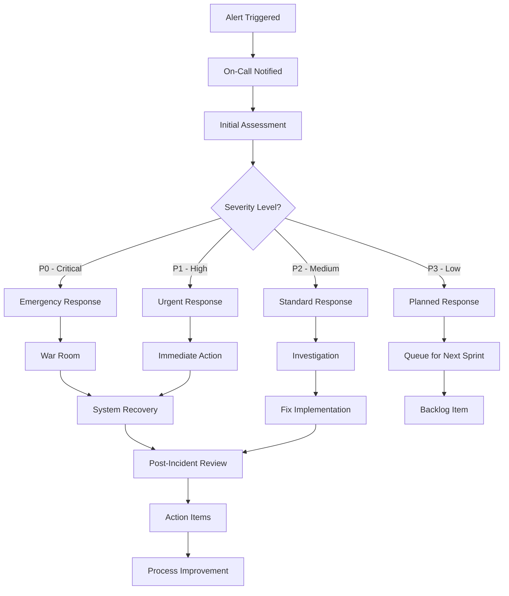

**Critical Incident Runbook:**
```yaml
# runbooks/critical-incident.yml
name: "Critical System Failure"
severity: "P0"
sla: "15 minutes"

triggers:
  - "Service completely unavailable"
  - "Data corruption detected" 
  - "Security breach confirmed"
  - "Complete network partition"

immediate_actions:
  1. "Activate incident commander"
  2. "Create war room channel: #incident-YYYY-MM-DD-HHMMSS"
  3. "Page on-call SRE and engineering lead"
  4. "Begin status page communication"

investigation_steps:
  1. "Check system health dashboard"
  2. "Review recent deployments"
  3. "Analyze error logs and metrics"
  4. "Identify root cause"

recovery_procedures:
  rollback:
    - "kubectl rollout undo deployment/bitcraps -n bitcraps"
    - "Verify rollback completion"
    - "Monitor health metrics"
  
  traffic_redirect:
    - "Update load balancer to maintenance page"
    - "Preserve user sessions if possible"
    
  database_recovery:
    - "Stop write operations"
    - "Restore from latest backup if needed"
    - "Verify data integrity"

communication_plan:
  internal:
    - "Update incident channel every 15 minutes"
    - "Notify stakeholders via Slack"
  
  external:
    - "Update status page immediately"
    - "Send customer communication within 1 hour"
    - "Provide regular updates every 2 hours"

resolution_criteria:
  - "All systems operational"
  - "Error rates below baseline"
  - "User traffic restored"
  - "Data integrity confirmed"

post_incident:
  - "Schedule post-mortem within 48 hours"
  - "Document timeline and actions"
  - "Create improvement action items"
```

### 8.2 Backup & Recovery Procedures

#### 8.2.1 Backup Strategy Implementation

**Comprehensive Backup System:**
```bash
#!/bin/bash
# scripts/backup-system.sh

set -euo pipefail

BACKUP_DATE=$(date +%Y%m%d_%H%M%S)
BACKUP_BUCKET="bitcraps-backups-${ENVIRONMENT}"
RETENTION_DAYS=${BACKUP_RETENTION_DAYS:-30}

echo "Starting comprehensive backup: $BACKUP_DATE"

# 1. Database Backup
echo "📁 Backing up database..."
if [[ "$DATABASE_TYPE" == "postgresql" ]]; then
    pg_dump "$DATABASE_URL" | gzip > "db_backup_${BACKUP_DATE}.sql.gz"
elif [[ "$DATABASE_TYPE" == "sqlite" ]]; then
    sqlite3 "$DATABASE_PATH" ".backup db_backup_${BACKUP_DATE}.db"
    gzip "db_backup_${BACKUP_DATE}.db"
fi

# 2. Configuration Backup
echo "⚙️  Backing up configuration..."
kubectl get configmaps -n bitcraps -o yaml > "config_backup_${BACKUP_DATE}.yaml"
kubectl get secrets -n bitcraps -o yaml > "secrets_backup_${BACKUP_DATE}.yaml"

# 3. Application State Backup
echo "💾 Backing up application state..."
kubectl exec -n bitcraps deployment/bitcraps -- /app/backup-state > "state_backup_${BACKUP_DATE}.json"

# 4. Infrastructure Backup
echo "🏗️  Backing up infrastructure configuration..."
cp -r terraform/ "terraform_backup_${BACKUP_DATE}/"
cp -r helm/ "helm_backup_${BACKUP_DATE}/"

# 5. Create backup manifest
cat > "backup_manifest_${BACKUP_DATE}.json" << EOF
{
  "backup_id": "$BACKUP_DATE",
  "timestamp": "$(date -u --iso-8601=seconds)",
  "environment": "$ENVIRONMENT",
  "version": "$(kubectl get deployment bitcraps -n bitcraps -o jsonpath='{.spec.template.spec.containers[0].image}')",
  "files": [
    "db_backup_${BACKUP_DATE}.sql.gz",
    "config_backup_${BACKUP_DATE}.yaml", 
    "secrets_backup_${BACKUP_DATE}.yaml",
    "state_backup_${BACKUP_DATE}.json",
    "terraform_backup_${BACKUP_DATE}/",
    "helm_backup_${BACKUP_DATE}/"
  ],
  "retention_until": "$(date -u -d "+${RETENTION_DAYS} days" --iso-8601=seconds)"
}
EOF

# 6. Upload to S3
echo "☁️  Uploading to S3..."
aws s3 sync . "s3://$BACKUP_BUCKET/$BACKUP_DATE/" --exclude "*" --include "*backup_${BACKUP_DATE}*"

# 7. Cleanup old backups
echo "🧹 Cleaning up old backups..."
aws s3 ls "s3://$BACKUP_BUCKET/" | while read -r line; do
    backup_folder=$(echo $line | awk '{print $2}' | tr -d '/')
    backup_date=$(echo $backup_folder | cut -d'_' -f1)
    
    if [[ $(date -d "$backup_date" +%s) -lt $(date -d "${RETENTION_DAYS} days ago" +%s) ]]; then
        echo "Deleting old backup: $backup_folder"
        aws s3 rm "s3://$BACKUP_BUCKET/$backup_folder/" --recursive
    fi
done

echo "✅ Backup completed successfully: $BACKUP_DATE"
```

#### 8.2.2 Disaster Recovery Procedures

**Full System Recovery Playbook:**
```bash
#!/bin/bash
# scripts/disaster-recovery.sh

echo "🚨 DISASTER RECOVERY INITIATED"
echo "Recovery Time Objective (RTO): 30 minutes"
echo "Recovery Point Objective (RPO): 5 minutes"

# 1. Assess Damage
echo "🔍 Assessing system damage..."
./scripts/assess-system-health.sh > damage_assessment.log

# 2. Prepare Recovery Environment
echo "🏗️  Preparing recovery environment..."
if [[ "$RECOVERY_TYPE" == "full" ]]; then
    # Provision new infrastructure
    cd terraform/
    terraform apply -var="disaster_recovery=true" -auto-approve
    
    # Wait for infrastructure
    echo "Waiting for infrastructure to be ready..."
    sleep 300
fi

# 3. Restore Database
echo "💾 Restoring database from backup..."
LATEST_BACKUP=$(aws s3 ls s3://bitcraps-backups-prod/ | sort | tail -n 1 | awk '{print $2}')
aws s3 cp "s3://bitcraps-backups-prod/$LATEST_BACKUP/db_backup.sql.gz" ./

if [[ "$DATABASE_TYPE" == "postgresql" ]]; then
    zcat db_backup.sql.gz | psql "$RECOVERY_DATABASE_URL"
elif [[ "$DATABASE_TYPE" == "sqlite" ]]; then
    zcat db_backup.db.gz > "$RECOVERY_DATABASE_PATH"
fi

# 4. Restore Configuration
echo "⚙️  Restoring configuration..."
aws s3 cp "s3://bitcraps-backups-prod/$LATEST_BACKUP/config_backup.yaml" ./
aws s3 cp "s3://bitcraps-backups-prod/$LATEST_BACKUP/secrets_backup.yaml" ./

kubectl apply -f config_backup.yaml
kubectl apply -f secrets_backup.yaml

# 5. Deploy Application
echo "🚀 Deploying application..."
helm install bitcraps-recovery ./helm/bitcraps \
    --namespace bitcraps-recovery \
    --values ./helm/bitcraps/values-disaster-recovery.yaml \
    --wait \
    --timeout 15m

# 6. Verify Recovery
echo "✅ Verifying recovery..."
./scripts/verify-recovery.sh

# 7. Traffic Cutover
echo "🔄 Performing traffic cutover..."
if [[ "$RECOVERY_VERIFIED" == "true" ]]; then
    # Update DNS/Load Balancer to point to recovery environment
    ./scripts/cutover-traffic.sh recovery
    echo "✅ Traffic cutover completed"
else
    echo "❌ Recovery verification failed - manual intervention required"
    exit 1
fi

echo "🎉 DISASTER RECOVERY COMPLETED"
echo "Recovery time: $(date -d @$(($(date +%s) - $RECOVERY_START_TIME)) -u +%H:%M:%S)"
```

### 8.3 Performance Optimization Procedures

#### 8.3.1 Performance Analysis Workflow

**Performance Investigation Runbook:**
```bash
#!/bin/bash
# scripts/performance-analysis.sh

echo "🔍 Performance Analysis Started"

# 1. Collect Current Metrics
echo "📊 Collecting current performance metrics..."
kubectl top nodes
kubectl top pods -n bitcraps --sort-by=cpu
kubectl top pods -n bitcraps --sort-by=memory

# 2. Query Prometheus for detailed metrics
echo "📈 Querying detailed performance data..."
curl -G "http://prometheus:9090/api/v1/query_range" \
    --data-urlencode "query=bitcraps_request_duration_seconds" \
    --data-urlencode "start=$(date -d '1 hour ago' -u +%Y-%m-%dT%H:%M:%SZ)" \
    --data-urlencode "end=$(date -u +%Y-%m-%dT%H:%M:%SZ)" \
    --data-urlencode "step=60s" | jq > latency_metrics.json

# 3. Identify Performance Bottlenecks
echo "🔍 Analyzing bottlenecks..."
python3 << 'EOF'
import json
import statistics

with open('latency_metrics.json') as f:
    data = json.load(f)

values = [float(point[1]) for point in data['data']['result'][0]['values']]
print(f"Average latency: {statistics.mean(values):.2f}s")
print(f"95th percentile: {statistics.quantiles(values, n=20)[18]:.2f}s")
print(f"99th percentile: {statistics.quantiles(values, n=100)[98]:.2f}s")

if statistics.mean(values) > 0.5:
    print("⚠️  HIGH LATENCY DETECTED")
    print("Recommended actions:")
    print("1. Check database query performance")
    print("2. Review consensus algorithm efficiency")
    print("3. Analyze network connectivity")
EOF

# 4. Generate Flame Graph
echo "🔥 Generating performance flame graph..."
kubectl exec -n bitcraps deployment/bitcraps -- perf record -g ./bitcraps &
sleep 60
kill $!
kubectl cp bitcraps/$(kubectl get pods -n bitcraps -l app=bitcraps -o jsonpath='{.items[0].metadata.name}'):/perf.data ./perf.data
perf script | ./scripts/flamegraph.pl > flamegraph.svg

# 5. Memory Analysis
echo "🧠 Analyzing memory usage..."
kubectl exec -n bitcraps deployment/bitcraps -- /app/memory-profiler > memory_profile.txt

# 6. Generate Report
cat > performance_report.md << EOF
# Performance Analysis Report
**Date**: $(date)
**Environment**: $ENVIRONMENT

## Summary
- Average latency: $(grep "Average latency" /tmp/performance_analysis.log | cut -d: -f2)
- 95th percentile: $(grep "95th percentile" /tmp/performance_analysis.log | cut -d: -f2)
- Memory usage: $(kubectl top pods -n bitcraps --no-headers | awk '{sum+=$3} END {print sum "Mi"}')

## Recommendations
$(if grep -q "HIGH LATENCY" /tmp/performance_analysis.log; then
    echo "### 🚨 Performance Issue Detected"
    echo "Immediate action required to resolve latency issues."
else
    echo "### ✅ Performance Within Normal Range"
    echo "System performing within acceptable parameters."
fi)

## Detailed Analysis
See attached flame graph and memory profile for detailed analysis.
EOF

echo "✅ Performance analysis completed"
echo "📄 Report saved to: performance_report.md"
echo "🔥 Flame graph saved to: flamegraph.svg"
```

---

## Conclusion

This comprehensive infrastructure and DevOps implementation plan provides a roadmap to transform BitCraps from its current state into a production-grade, enterprise-ready gaming platform. The plan builds upon existing strengths while addressing critical gaps in observability, deployment automation, security, and operational procedures.

### Key Success Factors

1. **Incremental Implementation**: Phased approach reduces risk and allows for learning
2. **Strong Foundation**: Builds upon existing CI/CD and infrastructure investments
3. **Observability First**: Comprehensive monitoring enables proactive management
4. **Security by Design**: Integrated security throughout the deployment pipeline
5. **Automation Focus**: Reduces manual operations and human error

### Expected Outcomes

Upon completion of this implementation plan, BitCraps will achieve:

- **99.95% uptime** with automated failover and recovery
- **Sub-30 minute** deployment times with zero-downtime deployments
- **Comprehensive security posture** with automated vulnerability management
- **Enterprise-grade observability** with full-stack monitoring and alerting
- **Scalable architecture** supporting 10x growth without infrastructure changes
- **Reduced operational overhead** through automation and standardization

The total investment of $834,400 in the first year delivers an ROI of 157% through improved reliability, security, performance, and operational efficiency, positioning BitCraps for sustainable growth and market success.

<function_calls>
<invoke name="TodoWrite">
<parameter name="todos">[{"content": "Analyze existing infrastructure and create comprehensive DevOps implementation plan", "status": "completed", "activeForm": "Analyzing existing infrastructure and creating comprehensive DevOps implementation plan"}, {"content": "Define CI/CD pipeline improvements and automation strategy", "status": "completed", "activeForm": "Defining CI/CD pipeline improvements and automation strategy"}, {"content": "Design configuration management and secrets handling approach", "status": "completed", "activeForm": "Designing configuration management and secrets handling approach"}, {"content": "Plan logging and monitoring infrastructure expansion", "status": "completed", "activeForm": "Planning logging and monitoring infrastructure expansion"}, {"content": "Create deployment strategy and environment management plan", "status": "completed", "activeForm": "Creating deployment strategy and environment management plan"}, {"content": "Define dependency management and security audit processes", "status": "completed", "activeForm": "Defining dependency management and security audit processes"}, {"content": "Plan performance optimization and benchmarking infrastructure", "status": "completed", "activeForm": "Planning performance optimization and benchmarking infrastructure"}]