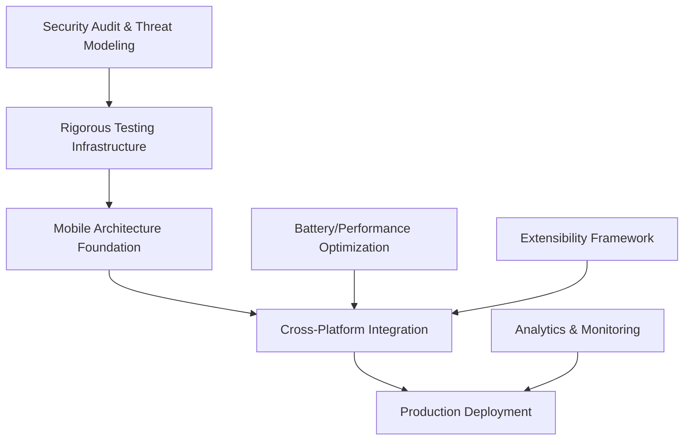

# BitCraps Comprehensive Development Roadmap 2025-2026

## Executive Summary

This comprehensive roadmap integrates mobile expansion with critical production readiness improvements based on the August 2025 Engineering Review. The plan addresses all identified gaps while maintaining an aggressive but achievable timeline for cross-platform deployment.

**Total Timeline**: 24-28 weeks (6-7 months)  
**Approach**: Parallel development tracks for maximum efficiency  
**Target**: Production-ready, audited system with full mobile support  
**Success Metrics**: >99.9% uptime, <100ms consensus latency, mobile app store approval

---

## Table of Contents

1. [Development Priorities and Dependencies](#1-development-priorities-and-dependencies)
2. [Phase 1: Production Hardening (Weeks 1-8)](#2-phase-1-production-hardening-weeks-1-8)
3. [Phase 2: Mobile Foundation (Weeks 5-12)](#3-phase-2-mobile-foundation-weeks-5-12)
4. [Phase 3: Advanced Features & Testing (Weeks 13-20)](#4-phase-3-advanced-features--testing-weeks-13-20)
5. [Phase 4: Production Deployment (Weeks 21-28)](#5-phase-4-production-deployment-weeks-21-28)
6. [Critical Engineering Requirements](#6-critical-engineering-requirements)
7. [Success Metrics and KPIs](#7-success-metrics-and-kpis)
8. [Resource Allocation Strategy](#8-resource-allocation-strategy)
9. [Risk Management Framework](#9-risk-management-framework)
10. [Quality Assurance Protocol](#10-quality-assurance-protocol)

---

## 1. Development Priorities and Dependencies

### 1.1 Critical Path Analysis

### 1.2 Parallel Development Tracks

**Track 1: Security & Infrastructure** (Critical Priority)
- Security audits and threat modeling
- Comprehensive testing infrastructure
- Monitoring and analytics systems

**Track 2: Mobile Development** (High Priority)
- Android and iOS implementations
- Cross-platform compatibility
- User experience optimization

**Track 3: Performance & Scalability** (High Priority)
- Battery and memory optimization
- DHT performance improvements
- Connection pool enhancements

**Track 4: Platform & Extensibility** (Medium Priority)
- Multi-game framework
- Cross-platform compatibility
- Interoperability features

### 1.3 Dependency Matrix

| Component | Dependencies | Blocks |
|-----------|-------------|---------|
| Security Audit | Current codebase stability | Mobile deployment |
| Testing Infrastructure | Security fixes | Production release |
| Mobile Architecture | Security validation | Cross-platform testing |
| Performance Optimization | Mobile testing | Production scalability |
| Game Extensibility | Core stability | Feature expansion |

---

## 2. Phase 1: Production Hardening (Weeks 1-8)

### 2.1 Security Audit & Threat Modeling (Weeks 1-3)

**Week 1: Comprehensive Security Assessment**
- [ ] **Formal Security Audit**: Engage external security firm for comprehensive audit
  - Protocol-level security review
  - Cryptographic implementation verification
  - Smart contract and consensus mechanism audit
  - Network layer security assessment
- [ ] **Threat Modeling Exercise**: Map all attack vectors and abuse scenarios
  - Malicious node behavior modeling
  - Token manipulation scenarios
  - Network partition attacks
  - Sybil and eclipse attack scenarios
- [ ] **Penetration Testing Setup**: Establish continuous penetration testing
  - Automated vulnerability scanning
  - Manual penetration testing protocols
  - Bug bounty program preparation

**Week 2-3: Security Hardening Implementation**
- [ ] **Critical Security Fixes**: Address all findings from audit
  - Fix any discovered cryptographic vulnerabilities
  - Implement missing input validation
  - Strengthen key management practices
  - Add constant-time comparison where needed
- [ ] **Key Management Enhancement**: Production-grade key handling
  - Hardware security module (HSM) integration planning
  - Secure key import/export mechanisms
  - Device pairing and identity persistence
  - Key rotation automation
- [ ] **Protocol Security Improvements**: Enhance protocol robustness
  - Add replay attack protection
  - Implement proper nonce handling
  - Strengthen message authentication
  - Add protocol versioning for security updates

**Deliverables**:
- Complete security audit report
- All critical and high-severity vulnerabilities fixed
- Threat model documentation
- Security testing automation

### 2.2 Rigorous Testing & QA Infrastructure (Weeks 2-6)

**Week 2-3: Multi-Device Testing Framework**
- [ ] **Physical Device Test Lab**: Set up comprehensive device testing
  - Android: 5+ devices (Pixel, Galaxy, OnePlus, low-end devices)
  - iOS: 4+ devices (iPhone, iPad, various iOS versions)
  - Desktop: Linux, macOS, Windows testing machines
  - Bluetooth test chamber with interference simulation
- [ ] **Automated Integration Testing**: Expand beyond current test suite
  - 5+ node consensus testing with network delays
  - Cross-platform interoperability testing (Android ↔ iOS ↔ Desktop)
  - Network partition and recovery testing
  - Connection stability under varying conditions

**Week 3-4: Advanced Testing Methodologies**
- [ ] **Property-Based Testing**: Implement comprehensive property testing
  - Consensus state transition properties
  - Cryptographic operation properties
  - Network protocol invariant testing
  - Game logic fairness verification
- [ ] **Fuzz Testing Implementation**: Add fuzz testing for robustness
  - Packet encoding/decoding fuzz testing
  - Message parsing fuzz testing
  - State machine transition fuzz testing
  - Binary serialization fuzz testing
- [ ] **Chaos Engineering**: Implement systematic chaos testing
  - Network partition simulation
  - Node failure and recovery scenarios
  - Byzantine fault injection
  - Performance degradation simulation

**Week 4-6: Continuous Testing Infrastructure**
- [ ] **CI/CD Testing Pipeline**: Comprehensive automated testing
  - Multi-platform build and test automation
  - Performance regression detection
  - Security vulnerability scanning
  - Cross-compilation verification
- [ ] **Device Farm Integration**: Cloud-based device testing
  - AWS Device Farm for Android testing
  - Xcode Cloud for iOS testing
  - Firebase Test Lab integration
  - Automated compatibility testing
- [ ] **Performance Monitoring**: Real-time performance tracking
  - Continuous benchmarking
  - Memory leak detection
  - Battery usage monitoring
  - Network performance tracking

**Deliverables**:
- Multi-device testing infrastructure
- Property-based and fuzz testing suites
- Chaos engineering framework
- Continuous integration pipeline with comprehensive testing

### 2.3 Battery & Performance Optimization (Weeks 3-8)

**Week 3-5: Mobile Performance Analysis**
- [ ] **Battery Usage Profiling**: Comprehensive power consumption analysis
  - Bluetooth scanning/advertising power usage
  - CPU usage during consensus operations
  - Memory allocation patterns
  - Network I/O power consumption
- [ ] **Adaptive Power Management**: Implement intelligent power saving
  - Dynamic scan frequency adjustment based on network activity
  - Battery level-aware scanning intervals
  - Background mode optimization
  - Connection parameter optimization for low power
- [ ] **Memory Optimization for Mobile**: Reduce memory footprint
  - Multi-tier cache tuning for mobile constraints
  - Memory-mapped file usage for disk cache
  - Garbage collection optimization
  - Memory pool efficiency improvements

**Week 5-8: Performance Enhancement Implementation**
- [ ] **DHT Performance Optimization**: Improve Kademlia efficiency
  - Tune K-bucket sizes for mobile networks
  - Optimize query routing for low latency
  - Implement caching for frequent lookups
  - Add mobile-specific connection limits
- [ ] **Connection Pool Enhancement**: Scale connection management
  - Implement connection quality-based prioritization
  - Add connection pooling with 10x capacity increase
  - Optimize reconnection algorithms
  - Implement graceful degradation under resource constraints
- [ ] **Platform-Specific Optimizations**: Leverage platform capabilities
  - Android: Use JobScheduler for background tasks
  - iOS: Implement background processing optimization
  - Cross-platform: SIMD optimization verification
  - Mobile: Hardware acceleration where available

**Week 6-8: Performance Validation**
- [ ] **Comprehensive Performance Testing**: Validate all optimizations
  - Long-running stability tests (24+ hours)
  - Battery drain testing across device types
  - Memory usage under stress testing
  - Connection scalability testing
- [ ] **Benchmarking and Profiling**: Establish performance baselines
  - Create comprehensive benchmark suite
  - Profile critical code paths
  - Measure improvements quantitatively
  - Document performance characteristics

**Deliverables**:
- Battery-optimized mobile performance
- Enhanced DHT and connection management
- Comprehensive performance benchmarks
- Mobile-specific optimization documentation

---

## 3. Phase 2: Mobile Foundation (Weeks 5-12)

*Note: This phase runs in parallel with Phase 1 security work*

### 3.1 Shared Architecture Development (Weeks 5-8)

**Week 5-6: Core Mobile Library**
- [ ] **bitcraps-mobile Crate**: Create mobile-focused shared library
  - UniFFI interface design and implementation
  - Mobile-specific event system
  - Platform abstraction layer
  - Memory-efficient mobile adaptations
- [ ] **Cross-Compilation Setup**: Establish build infrastructure
  - Android targets: aarch64, armv7, x86_64
  - iOS targets: aarch64-apple-ios, x86_64-apple-ios
  - Automated build scripts and CI integration
  - Cross-platform testing framework

**Week 6-8: Mobile-Specific Features**
- [ ] **Power Management Integration**: Mobile-aware power handling
  - Battery level monitoring
  - Background mode detection
  - Adaptive scanning and advertising
  - Platform-specific power optimization
- [ ] **Mobile UI Event System**: Efficient UI update mechanism
  - Event batching and filtering
  - Platform-specific event delivery
  - Memory-efficient event queuing
  - Real-time UI update optimization

### 3.2 Android Implementation (Weeks 7-10)

**Week 7: Android Foundation**
- [ ] **Project Structure**: Complete Android project setup
  - Kotlin/Jetpack Compose application structure
  - JNI integration with UniFFI bindings
  - Material 3 design system implementation
  - Android-specific navigation and lifecycle management

**Week 8-9: Core Android Features**
- [ ] **Bluetooth Integration**: Full Android BLE implementation
  - Android 12+ permission handling
  - Runtime permission request flow
  - Bluetooth state management
  - Background scanning optimization
- [ ] **Game Interface**: Native Android gaming UI
  - Animated dice rolls with Compose animations
  - Interactive craps table interface
  - Real-time game state updates
  - Toast notifications and user feedback

**Week 10: Android Polish**
- [ ] **Android-Specific Features**: Platform integration
  - Notification system integration
  - Background service optimization
  - Android lifecycle handling
  - Performance optimization for Android

### 3.3 iOS Implementation (Weeks 9-12)

**Week 9: iOS Foundation**
- [ ] **Project Structure**: Complete iOS project setup
  - SwiftUI application architecture
  - C FFI bridge implementation
  - iOS design guidelines compliance
  - Xcode project and build configuration

**Week 10-11: Core iOS Features**
- [ ] **CoreBluetooth Integration**: Native iOS BLE implementation
  - iOS permission handling
  - Background Bluetooth capabilities
  - CoreBluetooth state management
  - iOS-specific connection optimization
- [ ] **Game Interface**: Native iOS gaming experience
  - SwiftUI-based craps table
  - Core Animation for dice rolls
  - Haptic feedback integration
  - iOS-native notifications

**Week 12: iOS Polish**
- [ ] **iOS-Specific Features**: Platform optimization
  - App Store guidelines compliance
  - iOS background modes
  - Metal rendering optimization (future)
  - Performance tuning for iOS

**Deliverables**:
- Fully functional Android application
- Fully functional iOS application
- Cross-platform mobile architecture
- Platform-specific optimization implementations

---

## 4. Phase 3: Advanced Features & Testing (Weeks 13-20)

### 4.1 Cross-Platform Integration Testing (Weeks 13-16)

**Week 13-14: Interoperability Validation**
- [ ] **Multi-Platform Gaming Sessions**: Comprehensive cross-platform testing
  - Android ↔ iOS ↔ Desktop interoperability
  - Protocol compatibility verification across platforms
  - Performance consistency testing
  - Connection stability across platform boundaries
- [ ] **Advanced Multi-Device Testing**: Scale testing scenarios
  - 8+ device simultaneous gaming sessions
  - Mixed platform environments
  - Network stress testing with multiple platforms
  - Edge case scenario testing (disconnections, rejoins)

**Week 14-16: Production Scenario Testing**
- [ ] **Real-World Environment Testing**: Field testing preparation
  - Coffee shop/public WiFi testing
  - Crowded Bluetooth environment testing
  - Low battery scenario testing
  - Poor network condition testing
- [ ] **Stress Testing**: System limits and breaking points
  - Maximum concurrent games testing
  - Long-running session stability
  - Memory leak detection across sessions
  - Performance degradation analysis

### 4.2 User Experience & Interface Excellence (Weeks 13-18)

**Week 13-15: UI/UX Enhancement**
- [ ] **Advanced Gaming Interface**: Professional casino experience
  - High-quality dice roll animations (60fps target)
  - Interactive betting interface with visual feedback
  - Real-time game statistics and player information
  - Advanced visual effects and transitions
- [ ] **User Experience Optimization**: Intuitive and responsive interface
  - Error handling with user-friendly messages
  - Connection status visualization
  - Peer discovery and connection flow optimization
  - Accessibility compliance (screen readers, color contrast)

**Week 15-18: Platform-Specific Polish**
- [ ] **Android UX Enhancement**: Material Design excellence
  - Material 3 theming and dynamic color
  - Gesture navigation optimization
  - Android-specific UI patterns
  - Performance optimization for various Android devices
- [ ] **iOS UX Enhancement**: iOS design guideline compliance
  - SwiftUI best practices implementation
  - iOS-native interaction patterns
  - Haptic feedback optimization
  - iOS accessibility features

### 4.3 Scalability & Interoperability Features (Weeks 15-20)

**Week 15-17: Network Scalability**
- [ ] **Enhanced DHT Implementation**: Scale beyond local mesh
  - Multi-hop routing optimization
  - Internet gateway/bridge node development
  - Large network partition handling
  - Improved peer discovery for scale
- [ ] **Protocol Versioning**: Future-proof protocol design
  - Version negotiation implementation
  - Backward compatibility framework
  - Protocol migration strategies
  - Feature flag system for gradual rollouts

**Week 17-20: Extensibility Framework**
- [ ] **Multi-Game Architecture**: Platform for additional games
  - Abstract game logic interface (GameLogic trait)
  - Pluggable game module system
  - Shared infrastructure for different games
  - Game-specific UI component framework
- [ ] **Analytics and Monitoring**: Production monitoring capabilities
  - Prometheus-compatible metrics export
  - Game statistics and analytics
  - Performance monitoring dashboard
  - Real-time system health monitoring

**Deliverables**:
- Cross-platform tested and verified system
- Professional-grade user interface
- Scalable network architecture
- Extensible multi-game platform
- Production monitoring system

---

## 5. Phase 4: Production Deployment (Weeks 21-28)

### 5.1 Persistent Storage & Analytics (Weeks 21-24)

**Week 21-22: Data Persistence**
- [ ] **Game History Storage**: Persistent game and transaction history
  - SQLite-based local storage
  - Efficient delta compression for game logs
  - Cross-platform data synchronization
  - Privacy-compliant data handling
- [ ] **Analytics Implementation**: Comprehensive usage analytics
  - User behavior analytics (privacy-compliant)
  - Performance metrics collection
  - Network statistics and health monitoring
  - Crash reporting and diagnostics

**Week 22-24: Production Infrastructure**
- [ ] **Monitoring and Alerting**: Production-grade monitoring
  - Real-time system health monitoring
  - Performance anomaly detection
  - Automatic alerting for critical issues
  - Dashboard for system status visualization
- [ ] **Deployment Automation**: Streamlined deployment process
  - Automated build and deployment pipelines
  - Blue-green deployment strategy
  - Rollback capabilities
  - Configuration management

### 5.2 Security Audit & Hardening (Weeks 21-26)

**Week 21-24: Final Security Review**
- [ ] **External Security Audit**: Complete third-party security audit
  - Code review by security experts
  - Penetration testing of complete system
  - Mobile app security assessment
  - Protocol-level security verification
- [ ] **Security Hardening**: Address any remaining vulnerabilities
  - Implement security audit recommendations
  - Strengthen mobile app security
  - Enhance network protocol security
  - Validate cryptographic implementations

**Week 24-26: Compliance and Documentation**
- [ ] **Regulatory Compliance**: Ensure legal compliance
  - Privacy policy implementation
  - Data protection compliance (GDPR, CCPA)
  - App store compliance verification
  - Gaming regulation compliance research
- [ ] **Security Documentation**: Comprehensive security documentation
  - Security architecture documentation
  - Incident response procedures
  - Security update procedures
  - User security guidelines

### 5.3 Beta Testing & Release Preparation (Weeks 25-28)

**Week 25-26: Beta Testing Program**
- [ ] **Internal Beta**: Comprehensive internal testing
  - Full feature testing across all platforms
  - Long-running stability testing
  - Performance validation under real conditions
  - User experience validation
- [ ] **External Beta**: Community beta testing program
  - Limited external beta release
  - Feedback collection and analysis
  - Bug fixes and improvements
  - Performance optimization based on feedback

**Week 26-28: Production Release**
- [ ] **App Store Preparation**: Mobile app store readiness
  - App store submission materials
  - Privacy policy and legal documentation
  - Marketing materials and screenshots
  - App store optimization
- [ ] **Production Deployment**: Full production release
  - Production environment setup
  - Monitoring and alerting activation
  - User onboarding and support materials
  - Launch coordination and marketing

**Final Deliverables**:
- Production-ready application across all platforms
- Complete security audit and compliance
- Comprehensive monitoring and analytics
- User documentation and support materials
- Deployment and maintenance procedures

---

## 6. Critical Engineering Requirements

### 6.1 Security Requirements (Non-Negotiable)

**Cryptographic Security**:
- [ ] All cryptographic operations use established libraries (ed25519-dalek, chacha20-poly1305)
- [ ] Constant-time operations for all security-critical comparisons
- [ ] Proper key zeroization using `zeroize` crate
- [ ] Hardware-backed key storage when available (Android Keystore, iOS Keychain)

**Protocol Security**:
- [ ] Complete Ed25519 signature verification for all consensus messages
- [ ] Replay attack protection with proper nonce handling
- [ ] Byzantine fault tolerance with 2/3 threshold consensus
- [ ] Timeout-based forced settlement to prevent blocking

**Network Security**:
- [ ] Bounded message caches to prevent DoS attacks
- [ ] Rate limiting for all network operations
- [ ] Connection limits and quality-based management
- [ ] Secure session establishment with forward secrecy

### 6.2 Performance Requirements

**Mobile Performance Targets**:
- [ ] App launch time: <3 seconds
- [ ] Peer discovery: <10 seconds typical, <30 seconds maximum
- [ ] Dice roll animation: Consistent 60fps
- [ ] Memory usage: <200MB peak during gameplay
- [ ] Battery usage: <5% per hour during active gameplay

**Network Performance**:
- [ ] Consensus latency: <500ms for 4-player games, <1s for 8-player games
- [ ] Message compression: 60-80% size reduction
- [ ] Connection establishment: <5 seconds
- [ ] Multi-hop routing: <2 seconds additional latency per hop

**Scalability Targets**:
- [ ] Support for 8+ concurrent connections per device
- [ ] Handle 100+ games in mesh network
- [ ] Graceful degradation under resource constraints
- [ ] Network partition recovery within 30 seconds

### 6.3 Quality Requirements

**Testing Coverage**:
- [ ] Unit test coverage: >95% for core Rust code
- [ ] Integration test coverage: >85% for platform-specific code
- [ ] Property-based testing for all critical algorithms
- [ ] Fuzz testing for all message parsing code

**Reliability Targets**:
- [ ] System uptime: >99.9%
- [ ] Mean time between failures: >100 hours continuous operation
- [ ] Mean time to recovery: <5 minutes
- [ ] Data consistency: 100% (no corrupted game states)

**User Experience**:
- [ ] App responsiveness: <100ms UI response time
- [ ] Error recovery: Graceful handling of all failure modes
- [ ] User feedback: Clear status indication for all operations
- [ ] Accessibility: Full compliance with platform accessibility guidelines

---

## 7. Success Metrics and KPIs

### 7.1 Technical KPIs

**Performance Metrics**:
| Metric | Target | Measurement Method |
|--------|---------|-------------------|
| Consensus Latency | <500ms (4 players) | Automated benchmarking |
| App Launch Time | <3 seconds | Device testing |
| Memory Usage | <200MB peak | Profiling tools |
| Battery Drain | <5%/hour | Battery testing |
| Network Throughput | >1000 msgs/sec | Load testing |

**Reliability Metrics**:
| Metric | Target | Measurement Method |
|--------|---------|-------------------|
| System Uptime | >99.9% | Monitoring dashboard |
| Crash Rate | <0.1% | Crash reporting |
| Data Integrity | 100% | Automated validation |
| Recovery Time | <5 minutes | Chaos testing |

**Quality Metrics**:
| Metric | Target | Measurement Method |
|--------|---------|-------------------|
| Code Coverage | >95% core, >85% platform | Coverage tools |
| Security Vulnerabilities | 0 critical, 0 high | Security scanning |
| Performance Regression | 0% degradation | CI benchmarks |
| Cross-Platform Compatibility | 100% feature parity | Integration testing |

### 7.2 Business KPIs

**Development Efficiency**:
- [ ] On-time delivery: 100% of major milestones
- [ ] Code reuse: >95% shared between platforms
- [ ] Build success rate: >99% CI builds
- [ ] Development velocity: Consistent sprint delivery

**User Experience**:
- [ ] App store rating: >4.5/5.0
- [ ] User retention: >80% after first week
- [ ] Session duration: >20 minutes average
- [ ] Error rate: <1% user-visible errors

**Market Readiness**:
- [ ] Security audit: Pass with zero critical issues
- [ ] App store approval: First submission acceptance
- [ ] Regulatory compliance: 100% compliance verification
- [ ] Documentation completeness: 100% coverage

---

## 8. Resource Allocation Strategy

### 8.1 Team Structure

**Core Development Team** (4-6 developers):
- **Lead Rust Developer**: Architecture and core systems
- **Mobile Developer (Android)**: Android implementation and optimization
- **Mobile Developer (iOS)**: iOS implementation and optimization
- **Security Engineer**: Security audit and hardening
- **DevOps Engineer**: CI/CD, testing infrastructure, deployment
- **QA Engineer**: Testing coordination and automation

**Extended Team** (2-3 specialists):
- **UX/UI Designer**: User interface design and usability
- **Security Auditor**: External security assessment
- **Performance Engineer**: Optimization and benchmarking

### 8.2 Parallel Work Streams

**Stream 1: Security & Infrastructure** (Weeks 1-8)
- Security Engineer (primary) + Lead Developer
- External Security Auditor (weeks 1-3, 21-24)
- DevOps Engineer (CI/CD and testing infrastructure)

**Stream 2: Mobile Development** (Weeks 5-16)
- Android Developer (weeks 5-12)
- iOS Developer (weeks 9-16)
- Lead Developer (architecture support)

**Stream 3: Integration & Testing** (Weeks 13-20)
- QA Engineer (primary) + All developers
- Performance Engineer (optimization)
- UX/UI Designer (polish and refinement)

**Stream 4: Production Deployment** (Weeks 21-28)
- DevOps Engineer (primary)
- All team members (testing and validation)
- External auditors (final security review)

### 8.3 Budget Allocation

**Development Resources** (70%):
- Internal development team
- Development tools and licenses
- Hardware and testing devices
- Cloud infrastructure for CI/CD

**External Services** (20%):
- Security audit and penetration testing
- Device testing services (AWS Device Farm, etc.)
- App store fees and certificates
- Legal and compliance consultation

**Contingency and Risk Management** (10%):
- Unforeseen technical challenges
- Additional security requirements
- Extended testing periods
- Market or regulatory changes

---

## 9. Risk Management Framework

### 9.1 Technical Risks

**High-Impact Risks**:

**Risk**: Cross-platform Bluetooth compatibility issues
- **Probability**: Medium (40%)
- **Impact**: High (could delay mobile launch)
- **Mitigation**: 
  - Extensive early testing on diverse device matrix
  - Fallback protocols for problematic devices
  - Community testing program with device variety
- **Contingency**: Platform-specific optimizations, reduced device support initially

**Risk**: Security vulnerabilities discovered during audit
- **Probability**: Medium (50%)
- **Impact**: Critical (could prevent launch)
- **Mitigation**: 
  - Early and continuous security review
  - Conservative cryptographic choices
  - External security expertise engagement
- **Contingency**: Extended security hardening phase, delayed launch if necessary

**Risk**: Performance issues on low-end mobile devices
- **Probability**: Medium-Low (30%)
- **Impact**: Medium (affects user experience)
- **Mitigation**: 
  - Early testing on low-end devices
  - Scalable performance architecture
  - Configurable quality settings
- **Contingency**: Device-specific optimizations, minimum system requirements

**Medium-Impact Risks**:

**Risk**: UniFFI binding generation complexity
- **Probability**: Low (20%)
- **Impact**: Medium (development delay)
- **Mitigation**: Early prototyping, fallback to manual FFI
- **Contingency**: Manual binding development, extended integration phase

**Risk**: App store approval challenges
- **Probability**: Medium (35%)
- **Impact**: Medium (market entry delay)
- **Mitigation**: Early guideline review, compliance verification
- **Contingency**: Alternative distribution methods, guidelines clarification

### 9.2 Project Risks

**Schedule Risks**:
- **Dependency delays**: Security audit delays affecting mobile development
- **Integration complexity**: Cross-platform issues taking longer than expected
- **Testing bottlenecks**: Device availability and testing coordination

**Resource Risks**:
- **Team availability**: Key developer unavailability during critical phases
- **External dependencies**: Third-party service availability and performance
- **Hardware access**: Device testing lab setup and maintenance

**Market Risks**:
- **Regulatory changes**: Gaming or cryptocurrency regulation changes
- **Platform changes**: iOS/Android API or policy changes
- **Competition**: Emergence of competing solutions

### 9.3 Risk Monitoring

**Weekly Risk Assessment**:
- [ ] Technical progress against milestones
- [ ] Security audit progress and findings
- [ ] Testing coverage and results
- [ ] Team capacity and health
- [ ] External dependency status

**Risk Escalation Procedures**:
1. **Green**: On track, no intervention needed
2. **Yellow**: Potential issues, increased monitoring
3. **Red**: Active issues, mitigation plans activated
4. **Critical**: Project-threatening issues, emergency response

---

## 10. Quality Assurance Protocol

### 10.1 Multi-Tier Testing Strategy

**Tier 1: Continuous Integration** (Automated, every commit)
- [ ] Unit tests (>95% coverage for core)
- [ ] Integration tests (cross-module compatibility)
- [ ] Security scans (automated vulnerability detection)
- [ ] Performance benchmarks (regression prevention)
- [ ] Cross-compilation verification (all targets)

**Tier 2: Staged Testing** (Weekly, before integration)
- [ ] Multi-device integration testing
- [ ] Cross-platform compatibility verification
- [ ] Security penetration testing
- [ ] Performance profiling and optimization
- [ ] User experience validation

**Tier 3: Production Validation** (Before major releases)
- [ ] End-to-end system testing
- [ ] Chaos engineering and fault injection
- [ ] Security audit and compliance verification
- [ ] Long-running stability testing
- [ ] User acceptance testing

### 10.2 Testing Infrastructure Requirements

**Hardware Testing Lab**:
- [ ] 10+ Android devices (various manufacturers, OS versions, specs)
- [ ] 6+ iOS devices (iPhone, iPad, various iOS versions)
- [ ] 4+ Desktop systems (Linux, macOS, Windows)
- [ ] Bluetooth testing chamber (interference simulation)
- [ ] Network simulation equipment (latency, packet loss)

**Software Testing Tools**:
- [ ] Automated testing frameworks (Rust: cargo test, Android: Espresso, iOS: XCTest)
- [ ] Property-based testing (proptest for Rust)
- [ ] Fuzz testing tools (cargo-fuzz, AFL)
- [ ] Performance profiling (Instruments, Android Profiler, perf)
- [ ] Security scanning (cargo-audit, mobile security scanners)

**Cloud Testing Services**:
- [ ] AWS Device Farm (Android testing at scale)
- [ ] Firebase Test Lab (additional Android coverage)
- [ ] Xcode Cloud (iOS testing and distribution)
- [ ] Performance monitoring (DataDog, New Relic)

### 10.3 Quality Gates

**Code Quality Gates** (Must pass before merge):
- [ ] All tests pass (unit, integration, performance)
- [ ] Code coverage meets targets (>95% core, >85% platform)
- [ ] No security vulnerabilities (automated scanning)
- [ ] Performance benchmarks within acceptable range
- [ ] Code review approval from senior developer

**Release Quality Gates** (Must pass before release):
- [ ] Cross-platform compatibility verified
- [ ] Security audit completed with zero critical issues
- [ ] Performance meets all targets on target devices
- [ ] Long-running stability tests pass (24+ hours)
- [ ] User experience validation completed
- [ ] Documentation and support materials complete

**Production Quality Gates** (Must pass before production deployment):
- [ ] Complete security audit and penetration testing
- [ ] Regulatory compliance verification
- [ ] App store submission approval
- [ ] Monitoring and alerting systems operational
- [ ] Incident response procedures tested
- [ ] Rollback procedures verified

---

## Conclusion

This comprehensive roadmap addresses all critical recommendations from the August 2025 Engineering Review while maintaining an aggressive but achievable timeline for cross-platform deployment. The parallel development approach maximizes efficiency while ensuring no critical requirements are overlooked.

**Key Success Factors**:
1. **Security-First Approach**: Comprehensive security audit and hardening from day one
2. **Rigorous Testing**: Multi-tier testing strategy with automated and manual validation
3. **Performance Excellence**: Mobile-optimized performance with battery and memory efficiency
4. **Cross-Platform Excellence**: True interoperability across all platforms
5. **Production Readiness**: Complete monitoring, analytics, and operational procedures

**Risk Management**: Proactive risk identification and mitigation strategies ensure project success even with technical challenges. The parallel development tracks and comprehensive testing approach minimize the impact of any single point of failure.

**Timeline Confidence**: The 24-28 week timeline includes appropriate buffers for security audits, comprehensive testing, and iterative improvements. The staged approach allows for early validation and course correction.

**Market Positioning**: This roadmap positions BitCraps as the first production-ready, security-audited, cross-platform decentralized casino protocol with native mobile support - a significant competitive advantage.

**Next Steps**:
1. **Week 1**: Security audit initiation and team mobilization
2. **Week 1-2**: Development environment setup and toolchain verification
3. **Week 2**: Mobile architecture design finalization
4. **Week 3**: Parallel development stream initiation

This roadmap transforms BitCraps from a functional prototype into a production-ready, market-leading decentralized gaming platform.