# BitCraps Visual Architecture Diagrams

This document provides visual representations of the BitCraps distributed gaming system architecture using Mermaid diagrams. These diagrams complement the Feynman curriculum chapters by providing visual learning aids.

## 1. System Architecture Overview

## 2. Consensus State Machine

## 3. Network Topology - Mesh Network Formation

## 4. Message Flow - Distributed Dice Roll

## 5. Byzantine Fault Tolerance Scenario

```mermaid
graph TB
    subgraph "Honest Nodes (67%)"
        H1[Node 1<br/>Value: A]
        H2[Node 2<br/>Value: A]
        H3[Node 3<br/>Value: A]
        H4[Node 4<br/>Value: A]
    end
    
    subgraph "Byzantine Nodes (33%)"
        B1[Node 5<br/>Value: B to some<br/>Value: A to others]
        B2[Node 6<br/>Silent/Crashed]
    end
    
    subgraph "Consensus Result"
        R[Final Value: A<br/>≥2/3 Agreement]
    end
    
    H1 --> R
    H2 --> R
    H3 --> R
    H4 --> R
    B1 -.->|Equivocating| R
    B2 -.->|No Response| R
    
    style B1 fill:#FF6B6B
    style B2 fill:#FF6B6B
    style H1 fill:#90EE90
    style H2 fill:#90EE90
    style H3 fill:#90EE90
    style H4 fill:#90EE90
    style R fill:#FFD700
```

## 6. Database Transaction Lifecycle

## 7. Cryptographic Operations Flow

## 8. Mobile Platform Architecture Comparison

## 9. Performance Optimization Pipeline

## 10. Deployment Architecture

## 11. Game Session Lifecycle

## 12. Testing Strategy Pyramid

## Usage in Curriculum

These diagrams should be embedded within the relevant Feynman curriculum chapters:

- **Diagram 1**: Chapter 3 (Library Architecture)
- **Diagram 2**: Chapter 19 (Consensus Engine)
- **Diagram 3**: Chapter 13 (Mesh Networking)
- **Diagram 4**: Chapter 14 (Consensus Algorithms)
- **Diagram 5**: Chapter 48 (Byzantine Fault Tolerance)
- **Diagram 6**: Chapter 11 (Database Systems)
- **Diagram 7**: Chapter 4-9 (Cryptography Modules)
- **Diagram 8**: Chapter 68 (Mobile Interface Design)
- **Diagram 9**: Chapter 38 (Performance Optimization)
- **Diagram 10**: Chapter 99 (Deployment Strategies)
- **Diagram 11**: Chapter 30 (Multi-Game Framework)
- **Diagram 12**: Chapters 46-55 (Testing Chapters)

## Rendering Instructions

To render these diagrams:

1. **Markdown Viewers**: Most modern markdown viewers support Mermaid natively
2. **GitHub**: Automatically renders Mermaid blocks in .md files
3. **VS Code**: Install the Mermaid extension for preview
4. **Export**: Use Mermaid CLI to export as SVG/PNG for presentations
5. **Interactive**: Use Mermaid Live Editor for customization

## Future Diagram Additions

Priority diagrams to add:

1. Merkle Tree Structure visualization
2. Network Partition Recovery scenarios
3. Token Economics flow chart
4. Security Threat Model diagram
5. Mobile Battery Optimization states
6. Cross-platform Message Format
7. Peer Discovery Mechanism
8. State Synchronization Protocol
9. Circuit Breaker Pattern
10. Event Sourcing Architecture

---

*These visual aids complement the text-based Feynman curriculum, providing visual learners with alternative ways to understand complex distributed systems concepts.*