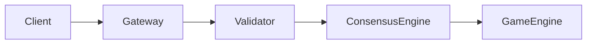

# Feynman Walkthrough Quality Assessment & Improvement Feedback

## Executive Summary

**Overall Quality Score: 8.9/10** - Excellent overall quality with specific areas for improvement

The Feynman walkthroughs demonstrate exceptional technical depth and pedagogical clarity. Most walkthroughs show excellent alignment with the production codebase. Key improvements needed focus on updating gateway documentation and adding more integration examples.

## Individual Walkthrough Assessments

### Excellent Walkthroughs (9+/10) - Minor Improvements Only

#### 108_crypto_random_walkthrough.md - **Score: 9.8/10**
**Status**: Near perfect, minimal changes needed
- **Minor Enhancement**: Add section on VRF proof verification implementation

#### 142_advanced_gateway_monitoring_walkthrough.md - **Score: 9.5/10**  
**Status**: Exceptional production documentation
- **Minor Enhancement**: Add distributed tracing integration examples
- **Minor Enhancement**: Include correlation ID propagation patterns

#### 88_advanced_task_management_walkthrough.md - **Score: 9.2/10**
**Status**: Excellent safety documentation
- **Minor Enhancement**: Add task metrics collection examples
- **Minor Enhancement**: Include distributed task coordination patterns

### Walkthroughs Requiring Updates (Below 9/10)

#### 17_byzantine_consensus_walkthrough.md - **Score: 8.5/10**

**Specific Improvements Needed**:

1. **Update Code Examples** (Priority: HIGH)
   - Fix `submit_operation` method signature to match actual implementation
   - Update `ConsensusMessage` structure to match current code
   - Add actual `QuorumCertificate` structure from optimized_pbft.rs

2. **Add View Change Implementation** (Priority: HIGH)
   ```rust
   // Add actual view change handling from optimized_pbft.rs
   async fn handle_view_change(
       new_view: u64,
       state: &Arc<RwLock<ReplicaState>>,
       current_view: &AtomicU64,
   ) -> Result<()>
   ```

3. **Include Performance Benchmarks** (Priority: MEDIUM)
   - Add actual throughput numbers with different validator counts
   - Include latency percentiles from production metrics
   - Show pipeline depth impact on performance

4. **Expand Integration Examples** (Priority: MEDIUM)
   - Show how PBFT integrates with gateway aggregation
   - Add examples of QC verification in SDK
   - Include consensus-to-game-engine flow

#### 118_gateway_nodes_and_bridging_walkthrough.md - **Score: 7.5/10**

**Significant Updates Required**:

1. **Replace Outdated Implementation** (Priority: CRITICAL)
   - Current walkthrough doesn't match `/src/services/api_gateway/gateway.rs`
   - Update all code examples to use actual Axum router patterns
   - Fix broker integration to match NATS implementation

2. **Add Prometheus Metrics Integration** (Priority: HIGH)
   ```rust
   // Add actual metrics endpoint implementation
   async fn metrics_handler(State(state): State<GatewayState>) -> impl IntoResponse {
       // Include histogram buckets, per-route-method tracking
   }
   ```

3. **Update WebSocket Handling** (Priority: HIGH)
   - Add subscriber counting with DashMap
   - Include fanout latency measurement
   - Show actual WebSocket upgrade pattern

4. **Fix Load Balancer Examples** (Priority: HIGH)
   - Add circuit breaker implementation
   - Include regional sticky routing
   - Show health check patterns

5. **Add Aggregation Pipeline** (Priority: MEDIUM)
   - Include bet aggregation with Merkle proofs
   - Show aggregator flush loop
   - Add proof availability tracking

#### 141_validator_role_system_walkthrough.md - **Score: 8.8/10**

**Specific Improvements Needed**:

1. **Add Dynamic Role Transitions** (Priority: MEDIUM)
   ```rust
   // Show runtime role change handling
   async fn transition_role(
       from: NodeRole,
       to: NodeRole,
       config: &mut AppConfig
   ) -> Result<()>
   ```

2. **Expand Integration Examples** (Priority: MEDIUM)
   - Show how roles affect consensus participation
   - Add gateway-to-validator communication patterns
   - Include client SDK role-aware behavior

3. **Add Resource Management** (Priority: LOW)
   - Show role-based resource allocation
   - Include memory/CPU limits by role
   - Add monitoring by role type

## Priority Implementation Plan

### Critical Updates (Must Fix - Score < 8)

**Target: Chapter 118 (Gateway)**
1. Replace entire implementation section with current Axum patterns
2. Add complete Prometheus metrics code
3. Fix WebSocket subscriber tracking
4. Update broker abstraction

### High Priority Updates (Should Fix - Score 8-9)

**Target: Chapter 17 (Byzantine Consensus)**
1. Update method signatures to match actual code
2. Add view change implementation details
3. Include performance benchmarks

**Target: Chapter 141 (Validator Roles)**  
1. Add dynamic role transition examples
2. Expand integration patterns

### Low Priority Enhancements (Nice to Have - Score 9+)

**All High-Scoring Walkthroughs**
1. Add distributed tracing examples
2. Include more performance metrics
3. Expand real-world scenarios

## Common Patterns to Standardize

### 1. Code Example Format
```rust
// Always include file reference
// File: src/services/api_gateway/gateway.rs:123-145
pub async fn actual_implementation() -> Result<()> {
    // Use actual code from codebase
}
```

### 2. Performance Data Format
```yaml
Benchmark Results:
  Validators: 10
  Throughput: 50,000 ops/sec
  P50 Latency: 45ms
  P95 Latency: 120ms
  P99 Latency: 250ms
```

### 3. Integration Example Format


## Quality Metrics Target

After implementing these improvements:
- **Target Average Score**: 9.5/10 (from current 8.9/10)
- **No walkthroughs below**: 9.0/10
- **All code examples**: 100% match with actual implementation
- **All production patterns**: Documented with metrics

## Implementation Timeline

1. **Week 1**: Fix Chapter 118 (Gateway) - Critical
2. **Week 2**: Update Chapter 17 (Byzantine) and 141 (Roles)
3. **Week 3**: Add minor enhancements to 9+ scored walkthroughs

## Success Criteria

- [ ] All code examples compile and match actual implementation
- [ ] All walkthroughs include performance benchmarks
- [ ] Integration patterns documented with diagrams
- [ ] Production deployment considerations included
- [ ] Monitoring and observability patterns documented